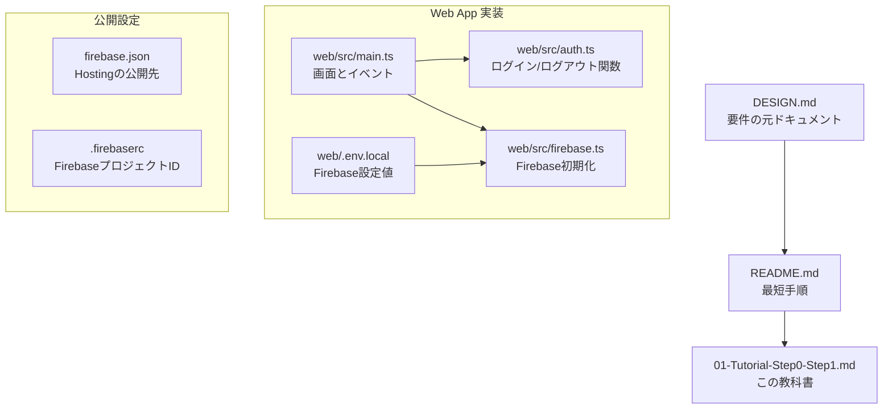
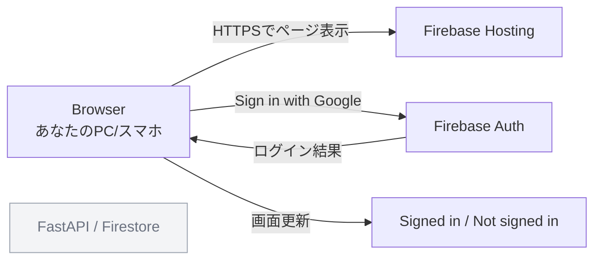
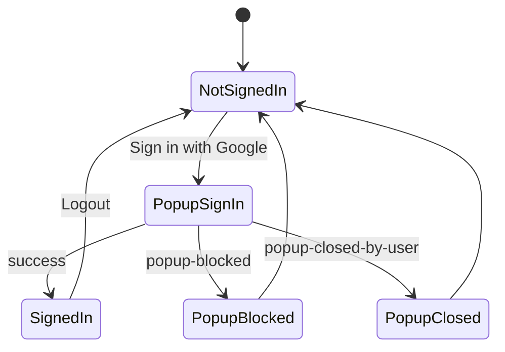

# 01-Tutorial: MoraCollect Step0 / Step1 教科書

この文書は、Webアプリ開発が初めての人向けに、MoraCollect の **Step0** と **Step1** を理解して実行するための教科書です。

- Step0: 公開ページを出す（Firebase Hosting）
- Step1: Google ログインを動かす（Firebase Auth）

> [!NOTE]
> このチュートリアルは `DESIGN.md` の Step0/Step1 だけを扱います。  
> FastAPI、Firestore、録音機能はまだ扱いません。

---

## Chapter 0: このチュートリアルのゴール

この章が終わる時点で、次の状態を目指します。

1. インターネット上のURLで `Hello MoraCollect` が表示される
2. Googleログインできる
3. ログアウトできる
4. ページを再読み込みしてもログイン状態が保持される

### 0-1. 先に結論: ここでつまずきやすい 5 点

1. `.firebaserc` の `your-firebase-project-id` は必ず実IDへ変更する  
   変更しないと `firebase deploy` は失敗します。
2. `web/.env.local` は必須です。作るだけでなく値を埋める必要があります。
3. Firebase Console で Google ログインを有効化しないとサインインできません。
4. `.env.local` を変更したら `npm run build` と `firebase deploy` をやり直す必要があります。
5. `auth/configuration-not-found` は「設定不足」か「別プロジェクト値の混在」が主原因です。

---

## Chapter 1: まず全体像（3分）

### 1-1. ファイルの関係（構成図）



### 1-2. 実行時のつながり（外部サービス）



> [!NOTE]
> Step1 時点では `FastAPI` と `Firestore` は未使用です。

### 1-3. いま何を作っているか（ひとことで）

- `web/` フォルダにある静的サイトを Hosting で公開する
- そのサイト内で Firebase Auth を使って Google ログインする

---

## Chapter 2: 用語のキーポイント（枠付き）

> [!IMPORTANT]
> Key Point: Hosting  
> 一言定義: Webページをインターネットへ公開する仕組み。  
> 今回は: Firebase Hosting が `web/dist` の中身を配信します。  
> 関連ファイル: `firebase.json`

> [!IMPORTANT]
> Key Point: Authentication  
> 一言定義: 「このユーザーは誰か」を確認する仕組み。  
> 今回は: Firebase Auth の Google ログインを使います。  
> 関連ファイル: `web/src/auth.ts`, `web/src/main.ts`

> [!IMPORTANT]
> Key Point: Build  
> 一言定義: 開発用コードを公開用ファイルへ変換する処理。  
> 今回は: `npm run build` で `web/dist` が生成されます。  
> 関連ファイル: `web/package.json`

> [!IMPORTANT]
> Key Point: Deploy  
> 一言定義: 作った公開用ファイルをサーバへ反映する処理。  
> 今回は: `firebase deploy --only hosting` を実行します。  
> 関連ファイル: `firebase.json`, `.firebaserc`

> [!IMPORTANT]
> Key Point: Environment Variable  
> 一言定義: コードに直書きしない設定値。  
> 今回は: Firebase の接続情報を `.env.local` で渡します。  
> 関連ファイル: `web/.env.example`, `web/.env.local`, `web/src/firebase.ts`

> [!NOTE]
> `.env.local` は設定値ファイルです。  
> このリポジトリでは `web/.gitignore` の `*.local` ルールで Git 追跡対象外です。

---

## Chapter 3: Step0 - 公開ページを出す

### 3-1. やること

`web` アプリをビルドし、Firebase Hosting にデプロイします。

### 3-2. なぜ必要か

「他の人がURLでアクセスできる状態」を先に作ることで、以後の検証が簡単になるためです。

### 3-3. 先に Firebase でやっておくこと（重要）

`firebase deploy` の前に、次を必ず終わらせます。

1. Firebase Console でプロジェクトを作成（または既存プロジェクトを選択）
2. `.firebaserc` の `default` を実際の Project ID に変更
3. Firebase CLI にログイン

実行コマンド:

```bash
firebase login --reauth
# Firebase CLI へログインし直す

firebase projects:list
# あなたがアクセスできる Project ID 一覧を確認
```

確認コマンド:

```bash
cat .firebaserc
# default が実際の Project ID になっているか確認
```

`.firebaserc` の設定例:

```json
{
  "projects": {
    "default": "your-real-project-id"
  }
}
```

> [!WARNING]
> `.firebaserc` が `your-firebase-project-id` のままだと、`firebase deploy` は失敗します。

### 3-4. 実行コマンド（1行説明つき）

```bash
cd web
# web フォルダへ移動

npm install
# 依存ライブラリをインストール

npm run build
# 公開用ファイル web/dist を生成

cd ..
# リポジトリルートへ戻る

firebase deploy --only hosting
# Firebase Hosting に web/dist を公開
```

### 3-5. 成功時に何が見えるか

- `firebase deploy` 後に Hosting のURLが表示される
- そのURLを開くと `MoraCollect` / `Hello MoraCollect` が見える

### 3-6. 確認（ローカル / 公開URLを分離）

ローカル確認:

```bash
cd web
npm run dev
```

- ブラウザで `http://localhost:5173` を開く
- 画面が表示されることを確認する

公開URL確認:

- `firebase deploy --only hosting` で表示されたURLを開く
- HTTPS で表示されることを確認する

---

## Chapter 4: Step1 - Googleログインを動かす

### 4-1. やること

Firebase Console 側で Google ログインを有効化し、アプリ側に Firebase 設定値を渡します。

### 4-2. なぜ必要か

コードだけではログインできません。  
「Firebaseプロジェクト設定」と「アプリ設定値」の両方がそろって初めてログインできます。

### 4-3. 作業手順

1. Firebase Console で `Authentication` を開く
2. `Sign-in method` で `Google` を `Enable` にする
3. Firebase Console で `Project settings > General > Your apps` を開く
4. Webアプリの `firebaseConfig` を確認する
5. `web/.env.local` を作成し、`firebaseConfig` の値をそのまま記入する
6. `Authentication > Settings > Authorized domains` に `localhost`、`<project-id>.web.app`、`<project-id>.firebaseapp.com` があるか確認する
7. `.firebaserc` の `your-firebase-project-id` を実IDに置換する
8. `npm run build` と `firebase deploy --only hosting` を実行する
9. ブラウザでログイン動作を確認する

### 4-4. `.env.local` の例

```bash
VITE_FIREBASE_API_KEY=xxxx
VITE_FIREBASE_AUTH_DOMAIN=your-project-id.firebaseapp.com
VITE_FIREBASE_PROJECT_ID=your-project-id
VITE_FIREBASE_APP_ID=1:1234567890:web:abcdef123456
VITE_FIREBASE_MEASUREMENT_ID=
```

### 4-5. Firebase Console のどこを見るか（迷いやすい点）

`your_api_key` は次の場所にあります。

1. Firebase Console
2. `Project settings`
3. `General`
4. `Your apps` の Webアプリ
5. `firebaseConfig` の `apiKey`

値の対応表:

- `VITE_FIREBASE_API_KEY` <- `firebaseConfig.apiKey`
- `VITE_FIREBASE_AUTH_DOMAIN` <- `firebaseConfig.authDomain`
- `VITE_FIREBASE_PROJECT_ID` <- `firebaseConfig.projectId`
- `VITE_FIREBASE_APP_ID` <- `firebaseConfig.appId`
- `VITE_FIREBASE_MEASUREMENT_ID` <- `firebaseConfig.measurementId`（あれば）

> [!NOTE]
> Firebase Console には `npm を使用する` と `<script> タグを使用する` があります。  
> このプロジェクト（Vite + TypeScript）は `npm を使用する` 側で進めます。

### 4-6. ログイン状態の流れ（状態遷移）



### 4-7. 成功時に何が見えるか

- 未ログイン: `Sign in with Google` ボタンが見える
- ログイン後: ユーザー名またはメールが表示され、`Logout` ボタンが見える
- 再読み込み後: ログイン状態が維持される

### 4-8. 重要: env を変えたら再ビルド・再デプロイ

`.env.local` を変更しただけでは、公開サイトは更新されません。  
必ず次を再実行します。

```bash
cd web
npm run build
cd ..
firebase deploy --only hosting
```

---

## Chapter 5: 動作確認チェックリスト

### Step0 チェック

- [ ] Firebase Project ID を `.firebaserc` に設定した
- [ ] `firebase login --reauth` で CLI ログインした
- [ ] Hosting URL が発行された
- [ ] 公開URLで `Hello MoraCollect` が表示された
- [ ] HTTPS でアクセスできた

### Step1 チェック

- [ ] Firebase Console で Google プロバイダを有効化した
- [ ] `web/.env.local` を作成して値を埋めた
- [ ] `.env.local` の値が同じ Firebase プロジェクト由来で揃っている
- [ ] `.env.local` 変更後に build/deploy を再実行した
- [ ] Googleログインが成功した
- [ ] ログアウトが成功した
- [ ] 再読み込み後にログイン状態が維持された
- [ ] 未ログイン時はログインボタンのみ表示された

---

## Chapter 6: よくあるエラーと対処

### エラー1: `firebase login --reauth` が必要と出る

- 症状: `firebase deploy --only hosting` が認証エラーで失敗する
- 原因: Firebase CLI のログイン期限切れ
- 対処:

```bash
firebase login --reauth
```

### エラー2: `Missing required environment variable` が出る

- 症状: 画面に `Firebase is not configured.` が表示される
- 原因: `web/.env.local` 未作成、または値不足
- 対処:

```bash
cd web
cp .env.example .env.local
```

その後、Firebase Console の値を正しく入力する。

### エラー3: `auth/operation-not-allowed`

- 症状: ログインボタン押下後に認証エラー
- 原因: Firebase Console で Google プロバイダが無効
- 対処: Authentication > Sign-in method > Google を有効化

### エラー4: `popup-blocked` または `popup-closed-by-user`

- 症状: ログインポップアップが完了しない
- 原因: ブラウザ設定でポップアップがブロック / ユーザーが閉じた
- 対処: ポップアップ許可後に再実行

### エラー5: デプロイ時にプロジェクトが解決されない

- 症状: Hosting 対象サイト解決エラー
- 原因: `.firebaserc` のプロジェクトIDがプレースホルダのまま
- 対処: `.firebaserc` の `default` を実際の Firebase Project ID に変更

### エラー6: `auth/configuration-not-found`

- 症状: `Sign in with Google` クリック後に `Authentication failed: auth/configuration-not-found`
- 原因1: Firebase Console で Google プロバイダが未有効
- 原因2: `.env.local` が別プロジェクトの値と混ざっている
- 原因3: `.env.local` 変更後に build/deploy をやり直していない
- 対処:

1. Authentication > Sign-in method > Google を有効化
2. `Project settings > Your apps` の同じ `firebaseConfig` から値を再コピー
3. 次を実行

```bash
cd web
npm run build
cd ..
firebase deploy --only hosting
```

---

## Chapter 7: ここまででできたこと / 次のStep2予告

### ここまででできたこと

- 公開URLを持つ Web アプリができた
- Google ログインの最小導線ができた
- 「未ログイン/ログイン済み」を画面表示で切り替えられた

### まだやっていないこと（意図的に範囲外）

- FastAPI（`/v1/ping` など）
- Firestore の読み書き
- 録音、アップロード、変換、ランキング

### 次のStep2でやること（予告）

- フロントから ID トークン付きで API を呼ぶ
- API 側でトークン検証して `uid` を返す
- 未ログイン 401 / ログイン 200 の動作確認を行う

Step2 の実装手順は次を参照:

- `README.md` の `5. Step2: Authenticated API ping (/v1/ping)`
- `api/README.md`

---

## 付録: まず読む順番

1. `DESIGN.md` の Step0/Step1 をざっと確認
2. この `01-Tutorial-Step0-Step1.md` を上から読む
3. `README.md` のコマンドを実行して動かす
