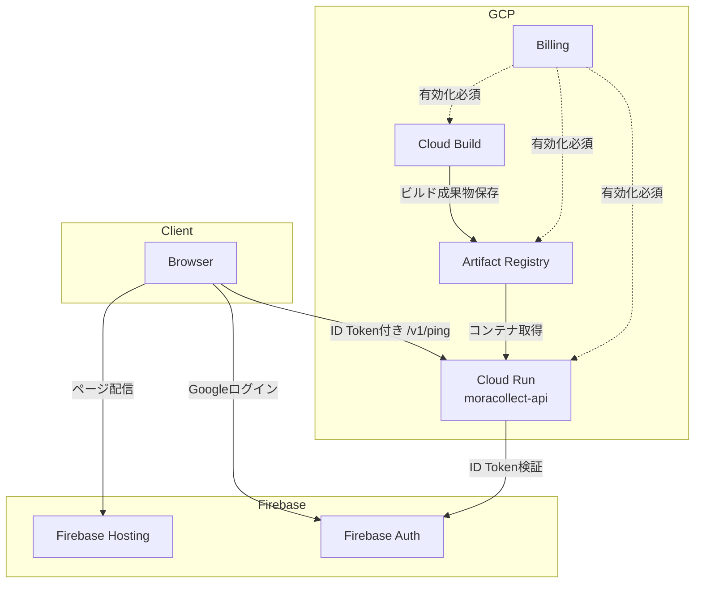

# 02-Tutorial: Step2 API Ping 実施記録と次アクション

この教科書は、Step2（認証付き `/v1/ping`）について、

1. ここまで実装した内容
2. あなたが次に実行する内容

をまとめた「作業ログ付きチュートリアル」です。

---

## Chapter 0: Step2 のゴール

Step2 のゴールは次の3つです。

1. ログイン済みのフロントから API を呼べる
2. 未ログインや不正トークンでは `401` になる
3. ログイン時は `200` で `uid` が返る

### 0-1. 先に結論: 今回つまずきやすかったポイント

1. Cloud Run は **Billing 有効化** が必要（未設定だと API 有効化で止まる）
2. `web/.env.local` に `VITE_API_BASE_URL` を **自分で1行追加**する必要がある
3. `VITE_API_BASE_URL` を変えたら、最後に `firebase deploy --only hosting` まで必要
4. Step1 と見た目が似ていても、Step2 は「`/v1/ping` が呼ばれているか」で判定する

---

## Chapter 1: ここまでの実施内容（実装済み）

### 1-1. API を新規作成済み

作成済みファイル:

- `api/app/main.py`
- `api/app/auth.py`
- `api/app/models.py`
- `api/requirements.txt`
- `api/Dockerfile`
- `api/.dockerignore`
- `api/README.md`

実装済み API:

- `GET /healthz`（無認証）
- `GET /v1/ping`（`Authorization: Bearer <ID_TOKEN>` 必須）

### 1-2. Web 側の Step2 連携を実装済み

変更済みファイル:

- `web/src/api.ts`
- `web/src/main.ts`
- `web/src/style.css`
- `web/.env.example`（`VITE_API_BASE_URL` 追加）

挙動:

- ログイン後に `getIdToken()` を取得
- `/v1/ping` を呼び出し
- 成功時はレスポンスJSONを画面表示（`uid` 含む）
- 失敗時はエラーメッセージを表示

### 1-3. ドキュメント更新済み

- `README.md` に Step2 セクション追加
- `01-Tutorial-Step0-Step1.md` に Step2 導線を追記

---

## Chapter 2: ローカル検証結果（確認済み）

確認済み結果:

- `/healthz` -> `200 OK`
- `/v1/ping`（Authorizationなし）-> `401`
- `/v1/ping`（不正トークン）-> `401`
- `web` の `npm run build` -> 成功

---

## Chapter 3: 構成図（Step2 時点）

```mermaid
flowchart LR
  U[Browser (web)] -->|ID Token付き /v1/ping| A[FastAPI api]
  A -->|verify_id_token| F[Firebase Admin SDK]
  F -->|Token検証| A
  A -->|200 uid or 401| U
```

### 3-1. 使っているサービスの関係図



---

## Chapter 4: あなたが次に実行する手順

> [!IMPORTANT]
> この章は「未完了部分（Cloud Run デプロイ）」です。  
> ここを実行すると Step2 が本番URLまでつながります。

### 4-1. gcloud 認証（必須）

この環境では `~/.config/gcloud` への書き込み制限が出たため、作業用設定ディレクトリを使います。

```bash
export CLOUDSDK_CONFIG=/tmp/moracollect-gcloud
gcloud auth login --no-launch-browser
```

`--no-launch-browser` 実行後に表示されるURLへアクセスし、認証コードを端末に貼り付けます。

### 4-2. プロジェクト設定と API 有効化

```bash
export CLOUDSDK_CONFIG=/tmp/moracollect-gcloud
gcloud config set project moracollect-watlab
gcloud services enable run.googleapis.com cloudbuild.googleapis.com artifactregistry.googleapis.com
```

> [!WARNING]
> ここで `Billing account ... is not found` が出た場合は、Cloud Console で  
> `moracollect-watlab` に課金アカウントをリンクしてから再実行します。

### 4-3. Cloud Run デプロイ

```bash
export CLOUDSDK_CONFIG=/tmp/moracollect-gcloud
gcloud run deploy moracollect-api \
  --source api \
  --region asia-northeast1 \
  --allow-unauthenticated \
  --set-env-vars FIREBASE_PROJECT_ID=moracollect-watlab
```

デプロイ完了後、表示される Service URL を控えます。

### 4-4. フロントを Cloud Run URL に接続

`web/.env.local` の `VITE_API_BASE_URL` を、上で取得した Cloud Run URL に変更します。

未設定の場合は新規追加します。  
例:

```bash
VITE_API_BASE_URL=https://moracollect-api-xxxxxx-an.a.run.app
```

### 4-5. 再ビルドと Hosting 再デプロイ

```bash
cd web
npm run build
cd ..
firebase deploy --only hosting
```

> [!IMPORTANT]
> `npm run build` だけでは公開サイトは更新されません。  
> 最後の `firebase deploy --only hosting` まで実行して反映します。

---

## Chapter 5: 受け入れチェックリスト

- [ ] `gcloud auth login` 完了
- [ ] Cloud Run サービス URL を取得
- [ ] `web/.env.local` の `VITE_API_BASE_URL` を Cloud Run URL に変更
- [ ] Hosting を再デプロイ
- [ ] 公開URLでログイン後、`/v1/ping` 結果に `uid` が表示される
- [ ] 公開URLで `API status: connected` が表示される
- [ ] 未ログインでは API ステータスが待機状態

---

## Chapter 6: よくある詰まりポイント

### 6-1. `You do not currently have an active account selected`

- 原因: `gcloud auth login` 未完了
- 対処: Chapter 4-1 を実施

### 6-2. ログインできるのに API が失敗する

- 原因候補:
  - `VITE_API_BASE_URL` が古い（ローカルURLのまま）
  - Hosting 再デプロイしていない
- 対処: Chapter 4-4, 4-5 を再実施

### 6-3. CORS エラー

- 原因: API 側の許可 origin とアクセス元が一致していない
- 対処: `api/app/main.py` の許可 origin と実際のドメインを照合

### 6-4. `Billing account ... is not found`

- 症状: `gcloud run deploy` 時に API 有効化で停止
- 原因: GCP プロジェクトに課金アカウントがリンクされていない
- 対処:
  1. Cloud Console > Billing で `moracollect-watlab` に課金アカウントを接続
  2. Chapter 4-2 の `gcloud services enable ...` を再実行
  3. Chapter 4-3 の `gcloud run deploy ...` を再実行

### 6-5. `VITE_API_BASE_URL` が見当たらない

- 症状: `.env.local` に項目がない
- 原因: Step1 では不要だったため、Step2 用に未追加
- 対処: `web/.env.local` に次の1行を新規追加

```bash
VITE_API_BASE_URL=https://moracollect-api-xxxxxx-an.a.run.app
```

### 6-6. Step1 と同じ見た目に見える

- 症状: ログインUIしか変わっていないように見える
- 原因候補:
  - 古いビルドが配信されている（deploy未実行）
  - ブラウザキャッシュが残っている
- 確認ポイント:
  - 画面に `API status` と API 結果欄がある
  - ログイン後に `API status: connected` になる
- 対処:
  1. `cd web && npm run build`
  2. `cd .. && firebase deploy --only hosting`
  3. ブラウザでハードリロード

---

## Chapter 7: 次のステップ

Step2 が完了したら、次は `DESIGN.md` の Step3（表示名の保存）へ進みます。

- `POST /v1/profile`
- `GET /v1/profile`
- Firestore の `users/{uid}` 連携
