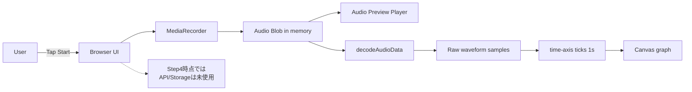
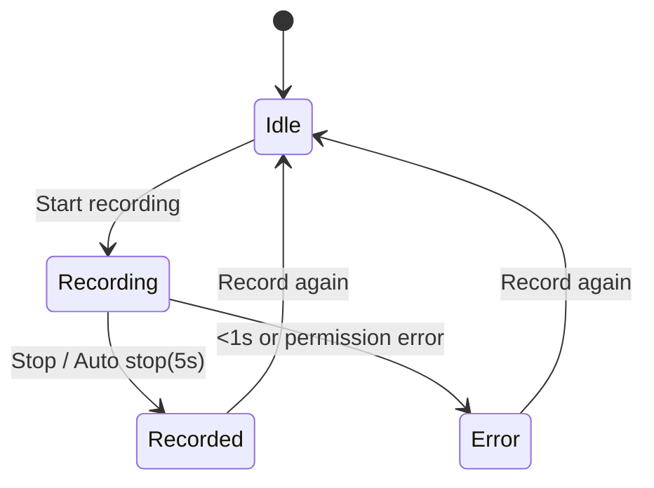

# 04-Tutorial: Step4 録音UI（保存しない）

この教科書は、Step4 の「録音だけ」を超初学者向けにまとめたものです。  
Step4 は **録音の安定性確認** が目的で、まだ Storage 保存はしません（保存は Step5）。

---

## Chapter 0: このStepのゴール

1. ログイン後に `Start recording` で録音開始できる
2. `Stop` で停止し、すぐ再生できる
3. 停止しなくても 5秒で自動停止する
4. `Record again` で連続して録音できる
5. 録音成功後に時間波形が表示される

制約:

- 1秒未満はエラー
- 1秒以上で成功（上限は「5秒付近で自動停止」）

---

## Chapter 1: MediaRecorder とは？

> [!IMPORTANT]
> **Key Point: MediaRecorder**
> `MediaRecorder` はブラウザ標準の録音APIです。  
> 今回は `web/src/recorder.ts` で使い、マイク音声を `Blob` としてメモリ上に保持します。  
> Step4 ではその `Blob` を `<audio controls>` で再生するだけで、サーバ保存はしません。

---

## Chapter 2: なぜ「保存しない」の？

Step4 の狙いは「端末差を越えて録音が安定するか」の確認です。

- iPhone/Android/PC で録音できるか
- 権限拒否や短すぎる録音を正しく扱えるか
- 連続録音で壊れないか

保存を同時に入れると不具合原因の切り分けが難しくなるため、Step5で分離します。

---

## Chapter 3: 全体フロー図（Browser内で完結）



---

## Chapter 4: 波形は何を見ている？

- 横軸: 時間（左から右へ）
- 縦軸: 音の振れ幅（大きい声ほど上下に大きく出る）
- この画面は「生波形（raw waveform）」を描画しています
- 1秒ごとに `0s,1s,2s...` の横軸ラベルを表示します
- これは分析用の厳密計測ではなく、録音の見える化です

なぜ録音後表示だけにしているか:

- 録音中リアルタイム描画より軽い
- iPhone/Android で安定しやすい
- Step4の目的（録音成功確認）に十分

---

## Chapter 5: 状態遷移図



---

## Chapter 6: 実装済みポイント

### 6-1. 追加ファイル

- `web/src/recorder.ts`
  - `start/stop/reset`
  - 5秒自動停止
  - 1秒未満エラー
  - エラー分類（not-supported, permission-denied, device-not-found, too-short, unknown）
- `web/src/waveform.ts`
  - `Blob -> PCM` デコード
  - 生波形を描画点数へダウンサンプリング
  - 1秒刻み横軸つき Canvas 描画 / クリア

### 6-2. 更新ファイル

- `web/src/main.ts`
  - 録音UI（Start/Stop/Record again）
  - 残り秒数表示
  - 録音後プレビュー再生
  - 録音後波形表示
  - ログイン状態で有効/無効切替
- `web/src/style.css`
  - 録音セクションのレイアウト
  - 波形Canvasスタイル
  - モバイル折り返し表示

---

## Chapter 7: 実行手順

### 7-1. ローカル確認

```bash
cd web
npm run dev
```

確認:

1. ログイン前は録音ボタンが無効
2. ログイン後に `Start recording`
3. `Stop` または 5秒待って自動停止
4. プレイヤーで再生
5. 生波形と `0s,1s...` の横軸が表示される
6. `Record again` でもう一度録音

### 7-2. 公開URLで確認（iPhone推奨）

```bash
cd web
npm run build
cd ..
firebase deploy --only hosting
```

`https://<project-id>.web.app` を iPhone Safari で開いて同じ確認をします。

---

## Chapter 8: iPhoneでのマイク許可手順

1. Safariで公開URLを開く
2. 初回録音時の許可ダイアログで `許可`
3. もし拒否してしまった場合:
   - iOS 設定 → Safari → マイク
   - または URLバー左のサイト設定からマイク許可

注意:

- `http://` だとマイクが使えない場合があります
- iPhoneは `https://` での確認を推奨します

---

## Chapter 9: よくあるつまずき

### 9-1. Startしても録音できない

- 原因候補:
  - マイク権限が拒否
  - ブラウザが非対応
- 対処:
  - 権限を許可し直す
  - Safari/Chromeの最新版で再確認

### 9-2. すぐ止めたらエラーになる

- 原因:
  - 1秒未満は仕様で失敗扱い
- 対処:
  - 1秒以上話してから停止

### 9-3. 前の音声が残る

- 対応済み:
  - `Record again` で古いURLを破棄し、新しい録音だけを表示

### 9-4. 波形が出ない

- 原因候補:
  - 録音が短すぎて失敗扱い
  - ブラウザの音声デコードが失敗
- 対処:
  - 1秒以上話して録音
  - もう一度 `Record again` で取り直す

### 9-5. 5秒で止まるはずなのに 4.9x 秒になる

- 意味:
  - 現在の実装では「5秒付近で停止」を目標にしており、**5.00秒ぴったり**は保証していません
- 主な理由:
  - `setTimeout` の実行タイミングゆらぎ
  - `MediaRecorder` の内部フレーム境界で停止位置が丸められる
  - エンコード単位（例: Opus）で数十ms単位のズレが出る
- 現時点の扱い:
  - Step4ではこの精度で十分（録音機能の安定確認が目的）
- 精度を上げるには:
  - `onstart` 基準で計時し停止判定を行う
  - 停止タイミングを少し後ろにずらして安全側に倒す（例: 5.1秒）
  - 最後にPCMへデコードして目標秒数でトリムする

---

## Chapter 10: ここまででできたこと / 次のStep

Step4完了で、録音の土台ができました。  
次の Step5 は以下です。

- `/v1/upload-url` をAPIで発行
- 録音 `Blob` を Storage へアップロード
- 収録データを永続化する流れへ進む
