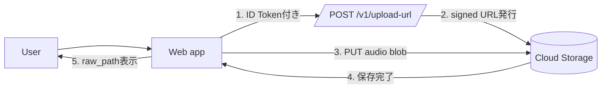

# 05-Tutorial: Step5 署名付きURLで録音をアップロード

この教科書は、Step5 の「録音済みBlobを Cloud Storage に保存する」部分だけを対象にした超初学者向けガイドです。  
Step4 の録音・再生はそのまま維持し、保存だけ追加します。

---

## Chapter 0: このStepのゴール

1. ログインして録音する
2. `Upload` ボタンを押す
3. `raw/<uid>/<record_id>.<ext>` に保存される
4. UIに保存先パスが表示される

今回まだやらないこと:

- Firestore `records` 登録（Step6）
- WAV変換（Step8）

---

## Chapter 1: 全体像（3分）



ポイント:

- 音声ファイル本体は API サーバーを経由せず、ブラウザから直接 Storage に送る
- API は「保存先パス」と「10分だけ有効なURL」を返す

---

## Chapter 2: 用語のキーポイント

> [!IMPORTANT]
> **Key Point: Signed URL**
> 一定時間だけ有効な一時URLです。  
> 今回は API が発行し、ブラウザが `PUT` でアップロードします。  
> 実装ファイル: `api/app/storage.py`, `api/app/main.py`, `web/src/upload.ts`

> [!IMPORTANT]
> **Key Point: raw_path**
> 保存先オブジェクトの論理パスです。  
> `raw/<uid>/<record_id>.<ext>` を API 側で強制し、クライアントは勝手に決められません。  
> 実装ファイル: `api/app/storage.py`

> [!IMPORTANT]
> **Key Point: CORS**
> ブラウザの別オリジン通信制約です。  
> signed URL への `PUT` は Storage バケット側の CORS 設定が必要です。  
> 設定先: Google Cloud Console > Cloud Storage > 対象バケット > CORS

---

## Chapter 3: 実装したAPI仕様

### 3-1. `POST /v1/upload-url`（認証必須）

Request:

```json
{
  "ext": "webm",
  "content_type": "audio/webm"
}
```

Response（例）:

```json
{
  "ok": true,
  "record_id": "uuid",
  "raw_path": "raw/<uid>/<record_id>.webm",
  "upload_url": "https://storage.googleapis.com/...",
  "method": "PUT",
  "required_headers": {
    "Content-Type": "audio/webm"
  },
  "expires_in_sec": 600
}
```

バリデーション:

- `ext`: `webm` / `mp4` のみ
- `content_type`: `audio/webm` / `audio/mp4` のみ
- `ext` と `content_type` の組み合わせ不一致は `400`

---

## Chapter 4: Web側の動き

録音成功後だけ `Upload` ボタンが有効になります。

`Upload` クリック時の流れ:

1. Firebase ID token を取得
2. `/v1/upload-url` を呼ぶ
3. 返却された signed URL へ `PUT`
4. 成功なら `Saved to: raw/...` を表示

失敗時は `Upload status: failed (...)` としてエラーを表示し、再試行できます。

---

## Chapter 5: 事前準備（Console側）

### 5-1. Storage を有効化

Firebase Console で Storage を有効化し、default bucket 名を確認します。

### 5-2. Cloud Run の環境変数

`STORAGE_BUCKET` を Cloud Run に渡します。

> [!IMPORTANT]
> `STORAGE_BUCKET` は **バケット名のみ** を設定します。  
> `gs://` を付けないでください。  
> 例: `moracollect-watlab.firebasestorage.app`

```bash
gcloud run deploy moracollect-api \
  --source api \
  --region asia-northeast1 \
  --allow-unauthenticated \
  --set-env-vars FIREBASE_PROJECT_ID=moracollect-watlab,STORAGE_BUCKET=<your-default-bucket>
```

### 5-3. バケット CORS

origin:

- `http://localhost:5173`
- `https://<project-id>.web.app`
- `https://<project-id>.firebaseapp.com`

method:

- `PUT`, `GET`, `HEAD`, `OPTIONS`

header:

- `Content-Type`

---

## Chapter 6: 実行手順

### 6-1. APIローカル起動

```bash
cd api
python3 -m venv .venv
source .venv/bin/activate
pip install -r requirements.txt
uvicorn app.main:app --reload --port 8080
```

### 6-2. Webローカル起動

`web/.env.local` の `VITE_API_BASE_URL` をローカルAPIに向ける:

```env
VITE_API_BASE_URL=http://localhost:8080
```

起動:

```bash
cd web
npm run dev
```

### 6-3. 本番反映

```bash
cd web
npm run build
cd ..
firebase deploy --only hosting
```

---

## Chapter 7: 受け入れチェック

1. 未ログイン時 `Upload` が無効
2. 録音前 `Upload` が無効
3. 録音後 `Upload` が有効
4. 成功時 `Saved to: raw/<uid>/...` が表示
5. `Record again` 後はアップロード状態がリセット

---

## Chapter 8: よくあるつまずき

### 8-1. `Failed to generate upload URL`

- 原因候補:
  - `STORAGE_BUCKET` 未設定
  - `STORAGE_BUCKET` に `gs://` を付けている
  - Cloud Run 実行SAの権限不足
- 対処:
  - Cloud Run 環境変数を再確認
  - IAMロール（Storage関連、必要なら Token Creator）を確認

### 8-2. ブラウザでCORSエラー

- 原因:
  - バケットCORS未設定 or origin不足
- 対処:
  - StorageバケットにCORS設定を入れる

### 8-3. `Upload status: failed (Failed to fetch)`

- 原因候補:
  - バケットCORS設定不足
  - signed URL先へのネットワーク到達失敗
- 対処:
  - CORSの origin/method/header を再確認
  - 同じ録音で再度 `Upload`（署名URLは10分で期限切れ）

### 8-4. 401 Unauthorized

- 原因:
  - ログイン切れ
  - Authorizationヘッダなし
- 対処:
  - 再ログインしてから再実行

### 8-5. 保存期限に関する誤解

- `expires_in_sec=600` は「署名URLの有効期限」です。
- 10分後にURLは失効しますが、**アップロード済みファイルは消えません**。
- 削除したい場合は、Storage側で明示的に削除操作が必要です。

### 8-6. `webm` と `mp4` が混在する

- 端末・ブラウザの MediaRecorder 対応差で自然に発生します。
- 現時点（Step5）は raw 保存が目的なので問題ありません。
- 後続Stepで形式統一（例: wav/16kHz）を行う前提です。

### 8-7. iPhone Chrome だけ録音できない

- Safariでは録音できるのにChromeだけ失敗する場合、Chrome側のマイク権限拒否が原因です。
- `設定 > Chrome > マイク` をONにして、ページを再読み込みして再試行してください。

---

## Chapter 9: 次のStep

Step5 では「ファイル保存」まで完了しました。  
次の Step6 は「保存した音声メタ情報を Firestore `records` に登録する」フェーズです。
