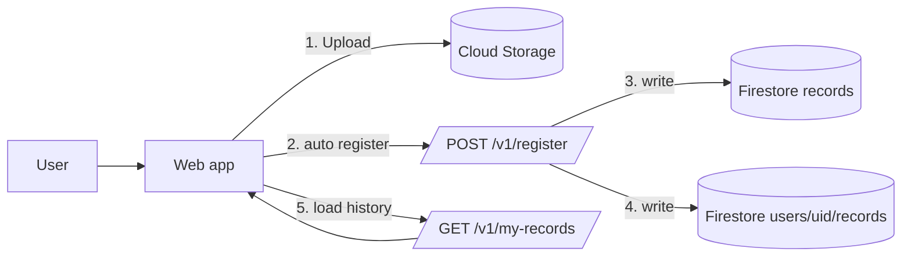

# 06-Tutorial: Step6 records登録（register / my-records）

この教科書は、Step6 の「アップロード済み音声を Firestore に登録して履歴表示する」部分だけに集中した、超初学者向けガイドです。  
Step5 の Upload 成功後に、次の一歩として `records` を増やせるようにします。

---

## Chapter 0: このStepのゴール

1. Upload 成功後に `POST /v1/register` が自動実行される
2. Firestore に `records/{record_id}` が作成される
3. 画面で `My records` に自分の履歴が表示される

今回まだやらないこと:

- prompts/scripts 選択UI（Step7）
- wav変換とQC（Step8）
- 既存rawの一括取り込み（backfill）

---

## Chapter 1: 全体像（3分）



ポイント:

- Step5 は「ファイル保存まで」
- Step6 は「DBに登録して管理可能にする」

---

## Chapter 2: 用語のキーポイント

> [!IMPORTANT]
> **Key Point: register**
> Uploadしたファイルのメタ情報を Firestore に登録する処理です。  
> 実装ファイル: `api/app/main.py`, `web/src/records.ts`, `web/src/main.ts`

> [!IMPORTANT]
> **Key Point: records 正本**
> レコードの正式データは `records/{record_id}` に保存します。  
> 履歴表示のために `users/{uid}/records/{record_id}` ミラーも作成します。

> [!IMPORTANT]
> **Key Point: object existence check**
> register時に raw ファイルが本当に存在するか確認します。  
> そのため Cloud Run 実行SAに `roles/storage.objectViewer` が必要です。

---

## Chapter 3: Step6で追加されたAPI

### 3-1. `POST /v1/register`（認証必須）

Request:

```json
{
  "record_id": "uuid",
  "raw_path": "raw/<uid>/<record_id>.webm",
  "client_meta": {
    "user_agent": "...",
    "platform": "...",
    "language": "ja-JP"
  },
  "recording_meta": {
    "mime_type": "audio/webm",
    "size_bytes": 58123,
    "duration_ms": 4870
  }
}
```

Response（例）:

```json
{
  "ok": true,
  "record_id": "uuid",
  "status": "uploaded",
  "already_registered": false
}
```

エラー:

- `401`: 認証失敗
- `400`: `record_id` / `raw_path` 不正
- `404`: Storageにrawが存在しない
- `409`: 他ユーザーの同一 `record_id` と競合

### 3-2. `GET /v1/my-records?limit=...`（認証必須）

- 自分の履歴のみ返す
- `limit` はデフォルト20、最大50

---

## Chapter 4: Web側の動き

Upload成功後の新しい流れ:

1. `Upload status: uploaded`
2. 自動で `register` を呼ぶ
3. 成功なら `Register status: registered`
4. `My records` を再読込して一覧更新

失敗時:

- `Register status: failed (...)` を表示
- `Retry register` ボタンで再試行可能

---

## Chapter 5: Console / IAM で確認すること

### 5-1. Cloud Run の環境変数

Step5と同様に `STORAGE_BUCKET` を設定済みであること。

### 5-2. Cloud Run 実行SAの権限

Step6で追加確認:

- `roles/storage.objectViewer`（raw存在確認に必要）

---

## Chapter 6: 実行手順

### 6-1. APIをデプロイ

```bash
gcloud run deploy moracollect-api \
  --source api \
  --region asia-northeast1 \
  --allow-unauthenticated \
  --set-env-vars FIREBASE_PROJECT_ID=moracollect-watlab,STORAGE_BUCKET=moracollect-watlab.firebasestorage.app
```

### 6-2. Webをデプロイ

```bash
cd web
npm run build
cd ..
firebase deploy --only hosting
```

---

## Chapter 7: 受け入れチェック

1. サインイン後に録音→Uploadできる
2. Upload後に `Register status` が成功になる
3. `My records` に新しい行が追加される
4. Firestore Console で `records/{record_id}` が存在する
5. `users/{uid}/records/{record_id}` も存在する

---

## Chapter 8: よくあるつまずき

### 8-1. `Register status: failed (raw object not found)`

- 原因:
  - Uploadが未完了のままregisterした
  - `raw_path` が壊れている
- 対処:
  - 先にUpload成功を確認
  - 再度 `Retry register`

### 8-2. `Register status: failed (Failed to register record)`

- 原因候補:
  - Cloud Run SA に `storage.objectViewer` がない
  - Firestore書き込み権限不足
- 対処:
  - IAMロールを見直して再デプロイ

### 8-3. `My records` が空のまま

- 原因候補:
  - registerが失敗している
  - 別アカウントでログインしている
- 対処:
  - `Register status` を確認
  - ログイン中アカウントを確認

### 8-4. Step5で前にUploadしたファイルが一覧に出ない

- 仕様です。Step6では「今回以降のregister実行分」が対象です。
- 既存rawのbackfillは別タスクで扱います。

---

## Chapter 9: 次のStep

Step6 で「保存した音声が records として管理可能」になりました。  
次の Step7 は「prompts/scripts を表示して収録フローを回す」フェーズです。
