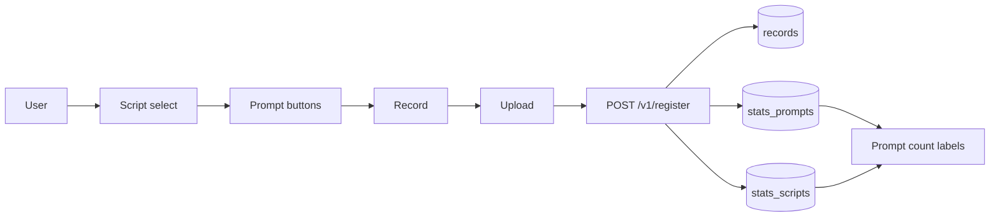
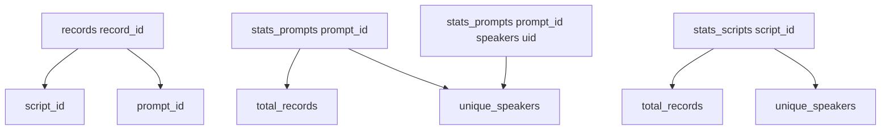

# 07-Tutorial: Step7 任意Prompt選択と件数可視化

この教科書は、Step7 の「任意の prompt を選んで収録する」機能を超初学者向けに解説します。  
目的は、**どの prompt にデータが偏っているかを全員が見ながら収録できる状態**を作ることです。

---

## Chapter 0: このStepのゴール

1. script を選ぶと prompt ボタン一覧が出る
2. 任意の prompt を選んで録音→Upload→Register できる
3. prompt ごとに `total_records` と `unique_speakers` が表示される
4. 登録後に件数表示が更新される
5. 現在の標準データ（`50音` 1 script + 104 prompts）で運用できる

今回まだやらないこと:

- wav変換/QC（Step8）
- 全体ダッシュボード画面（Step9）
- ランキング詳細（Step10）

---

## Chapter 1: 全体像（3分）



ポイント:

- Step6までは `script_id/prompt_id` が固定値でした
- Step7 からは、**ユーザーが選んだ script/prompt が records に保存**されます

---

## Chapter 2: 用語のキーポイント

> [!IMPORTANT]
> **Key Point: script**  
> prompt をまとめる収録セットです。  
> 例: 「50音」  
> 今回は script は1件だけ（`s-gojuon`）で、その中に prompt を複数入れます。

> [!IMPORTANT]
> **Key Point: prompt**  
> 実際に読む 1 テキストです。  
> 例: 「あ」「ぎ」「ぢ」「きゃ」
> script を「50音」にして、prompt で「読み上げる1つの文字」を選びます。

> [!IMPORTANT]
> **Key Point: total_records / unique_speakers**  
> `total_records` は録音総数、`unique_speakers` は何人が録音したかです。  
> 偏り確認にはこの2つを同時に見るのが重要です。

---

## Chapter 3: Firestore設計（Step7）



保存先:

- 正本: `records/{record_id}`
- 履歴ミラー: `users/{uid}/records/{record_id}`
- Prompt統計: `stats_prompts/{prompt_id}`
- Script統計: `stats_scripts/{script_id}`

---

## Chapter 4: 追加API

1. `GET /v1/scripts`（認証必須）
2. `GET /v1/prompts?script_id=...`（認証必須）
3. `POST /v1/register` は `script_id` と `prompt_id` が必須

`POST /v1/register` の追加バリデーション:

- `script_id` 不正 -> `400`
- `prompt_id` 不正 -> `400`
- prompt が script に属さない -> `400`

---

## Chapter 5: 初期データ投入（seed）

seedファイル:

- `infra/seeds/scripts.json`
- `infra/seeds/prompts.json`

現在のseed仕様:

- script は `s-gojuon` の1件（表示名: `50音`）
- prompt は 104件
  - 清音46
  - 濁音/半濁音25（`だ行` は `ぢ/づ`）
  - 拗音33
- UIの表示順は `order` に従う固定50音順

投入コマンド:

```bash
cd api
python3 -m venv .venv                 # 初回のみ
source .venv/bin/activate
pip install -r requirements.txt       # 初回のみ
# ADC未設定の場合のみ:
# gcloud auth application-default login
python3 scripts/seed_step7_data.py
deactivate
```

---

## Chapter 6: 動作確認チェックリスト

1. サインイン後に script dropdown が表示される
2. script 切り替えで prompt ボタン一覧が切り替わる
3. prompt を選んだ時だけ録音開始できる
4. 録音→Upload→Register が成功する
5. 登録後に prompt の件数表示が更新される
6. 別ユーザーでも同 prompt の件数変化が見える

---

## Chapter 7: よくあるつまずき

### 7-1. `Upload status: select a prompt first`

- 原因: prompt 未選択
- 対処: prompt ボタンを先に選ぶ

### 7-2. `Register status: failed (script_id is invalid)`

- 原因: seed未投入 or script id不整合
- 対処: `python3 scripts/seed_step7_data.py` を再実行

### 7-3. `Scripts: failed (Not Found)`

- 原因候補:
  - Web が古い API URL を見ている
  - Cloud Run が Step7 未反映 revision のまま
- 対処:
  - `web/.env.local` の `VITE_API_BASE_URL` を確認
  - API を再デプロイし、`/v1/scripts` が存在する revision に更新
  - Hosting も再ビルド/再デプロイ

### 7-4. `ModuleNotFoundError: No module named 'firebase_admin'`

- 原因: Python 仮想環境が未有効化、または依存未インストール
- 対処:
  - `source .venv/bin/activate`
  - `pip install -r requirements.txt`
  - もう一度 seed を実行

### 7-5. `DefaultCredentialsError`（ADC未設定）

- 原因: Firestore へ書き込む認証情報（Application Default Credentials）が未設定
- 対処:
  - `gcloud auth application-default login`
  - 必要に応じて `gcloud config set project moracollect-watlab`
  - その後 seed を再実行

### 7-6. `UserWarning: ... without a quota project`

- 意味: 警告であり、必ずしも失敗ではありません（seed が成功する場合あり）
- 対処（推奨）:
  - `gcloud auth application-default set-quota-project moracollect-watlab`

### 7-7. `prompt ... references unknown script_id ...`

- 原因: `infra/seeds/prompts.json` の `script_id` と `infra/seeds/scripts.json` が不一致
- 対処:
  - prompts 側を `s-gojuon` に揃える
  - seed を再実行

### 7-8. prompt件数が増えない / 反映されない

- 原因候補: register失敗
- 対処:
  - `Register status` を確認し、失敗時は `Retry register`
  - upload/register 成功時は自動更新されるので、失敗表示が出ていないか確認

### 7-9. 古い script / prompt が残る

- 原因: 以前のseedデータがFirestoreに残っている
- 対処: 最新の `seed_step7_data.py` を再実行する
  - このスクリプトは seed に無い `scripts/prompts` を prune（削除）します

---

## Chapter 8: 次のStep

Step7 で「どの prompt が不足しているか」を見ながら収録できるようになりました。  
次は Step8（raw->wav変換 + QC）で、学習用データ品質を統一します。
