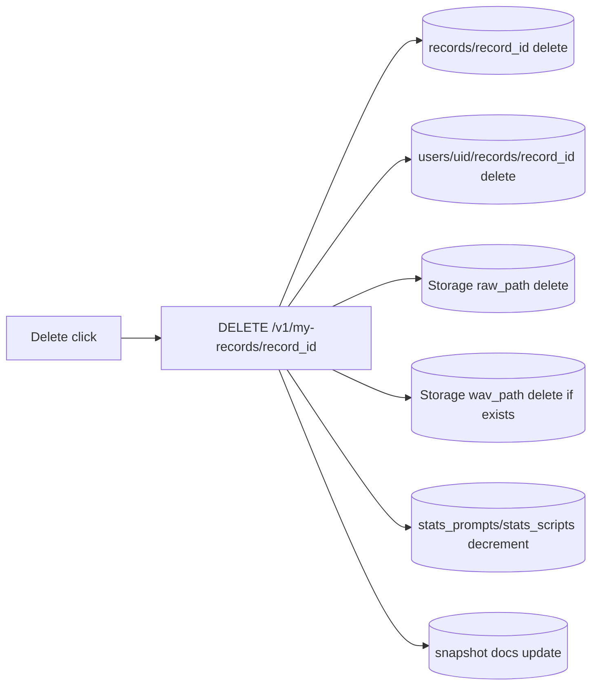
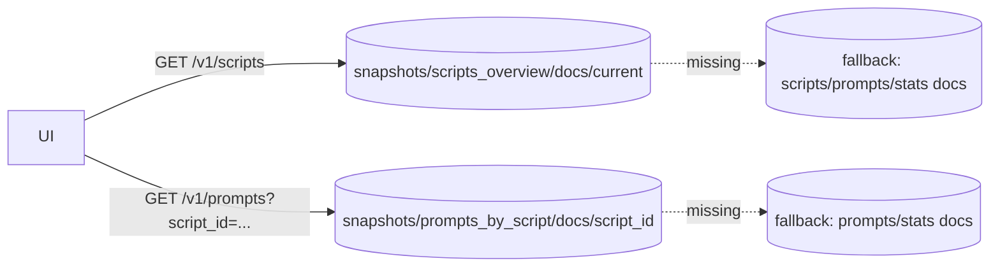

# 08-Tutorial: Step8 自分の録音削除 + read最小化

この教科書は、Step8 の2つをまとめて説明します。  
1つ目は **自分の録音データ削除**、2つ目は **Firestore read最小化** です。

---

## Chapter 0: このStepのゴール

1. `My records` から自分の録音を1件ずつ完全削除できる
2. `My records` の `Load` で過去録音を再生・波形表示できる
3. scripts/prompts の件数表示を、手動更新方式にして read 消費を抑える
4. `GET /v1/scripts` / `GET /v1/prompts` を snapshot 優先読みへ変更する
5. `GET /v1/my-records` で `prompt_text` を返し、毎回 prompt doc を引かない

今回まだやらないこと:

- 他ユーザーのデータ削除
- 一括削除
- wav変換（Step10）

---

## Chapter 1: なぜ read最小化が必要だったか

Step7 までは、件数を最新表示するために scripts/prompts を何度も再取得しやすく、  
Firestore の無料 read 枠が想定より早く消費される状況がありました。

Step8.2 での方針:

1. **再取得回数を減らす**  
   register/delete 後の自動再取得をやめる
2. **1回あたりの read を減らす**  
   scripts/prompts を snapshot 1doc読み中心にする
3. **必要時だけ更新する**  
   UI に `Refresh counts` を置き、明示操作でのみ最新化

> [!IMPORTANT]
> **Key Point: 最新性より read節約を優先**  
> 収録中は「だいたいの件数表示」で進め、必要なときだけ手動更新する設計です。

---

## Chapter 2: Step8 全体データフロー





---

## Chapter 3: read最小化の実装ポイント

### 3-1. 手動 Refresh モード

- register/delete 後に scripts/prompts を自動再取得しない
- 画面に `Refresh counts` ボタンを追加
- ステータスに `manual refresh mode` を表示して挙動を明示

### 3-2. snapshot 1doc読み

読み取り先:

- `snapshots/scripts_overview/docs/current`
- `snapshots/prompts_by_script/docs/{script_id}`

これにより、`/v1/scripts` と `/v1/prompts` の read を大きく削減できます。

### 3-3. `prompt_text` を履歴ミラーに保存

`users/{uid}/records/{record_id}` に `prompt_text` を保存するため、  
`GET /v1/my-records` で prompt doc 参照が不要になります。

### 3-4. 期限切れURLの自動再取得（Load）

`Load` で使う署名付きGET URL（600秒）が期限切れの場合のみ、  
フロントが1回だけURL再取得して自動リトライします。

---

## Chapter 4: API仕様（Step8で使うもの）

1. `DELETE /v1/my-records/{record_id}`（認証必須）
2. `GET /v1/my-records/{record_id}/playback-url`（認証必須）
3. `GET /v1/my-records?limit=...`（`prompt_text` を含む）

削除成功レスポンス:

```json
{
  "ok": true,
  "record_id": "xxxxxxxx-xxxx-xxxx-xxxx-xxxxxxxxxxxx",
  "deleted": true
}
```

主なエラー:

- `401`: 未ログイン
- `403`: 他人の record_id
- `404`: record が存在しない / raw が無い
- `500`: サーバ内部エラー（権限不足など）

---

## Chapter 5: 操作手順（運用）

### 5-1. 削除

1. サインイン
2. `My records` で対象を選ぶ
3. `Delete` 実行
4. `My records` から消えることを確認
5. 必要なら `Refresh counts` で件数表示を最新化

### 5-2. 過去録音の再確認（Load）

1. `Load` を押す
2. `Recording status: loaded from my records (read-only)` を確認
3. 再生・波形確認後、不要なら `Delete`

> [!IMPORTANT]
> **Key Point: Loadした音声は再アップロード不可**  
> 読み込んだ音声はレビュー専用（read-only）です。

---

## Chapter 6: snapshot 再構築（メンテナンス）

seed 更新後や snapshot 欠損時は、次を実行します。

```bash
cd api
source .venv/bin/activate
python3 scripts/build_stats_snapshots.py
deactivate
```

期待ログ例:

- `Snapshot build completed: scripts=..., prompt_snapshot_docs=..., project=moracollect-watlab`

---

## Chapter 7: よくあるつまずき

### 7-1. `delete failed (record not found)`

- 原因: すでに削除済み、または古い表示
- 対処: `My records` を再取得して再確認

### 7-2. `delete failed (record does not belong to authenticated user)`

- 原因: 他ユーザーの record_id
- 対処: 自分の `My records` からのみ削除

### 7-3. `My records: load failed (Not Found)`

- 原因: Storage 側に raw が無い、または `raw_path` 不整合
- 対処: その record は削除し、再録音して登録し直す

### 7-4. `delete failed (Storage delete permission denied)`

- 原因: Cloud Run 実行SAに削除権限がない
- 対処: バケット `gs://moracollect-watlab.firebasestorage.app` に `roles/storage.objectUser` を付与

### 7-5. Firestore read が急増する

- 原因候補:
  - `Refresh` 連打
  - snapshot 未構築で fallback 読みが発生
- 対処:
  - 必要時のみ `Refresh counts`
  - `build_stats_snapshots.py` 実行で snapshot を再構築

---

## Chapter 8: 次のStep

Step8 で「削除」と「read節約運用」が整いました。  
次は Step9 で `Top contributors`（ランキング表示）を追加します。
