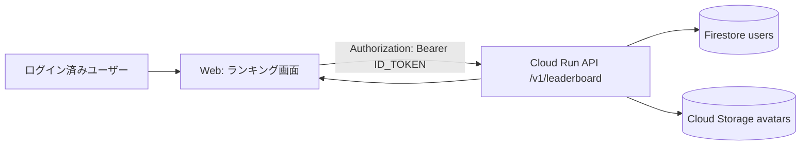

# 09-Tutorial: Step9 Top contributors ランキング

この教科書は Step9 の「ランキング表示」だけに絞って説明します。  
対象は **累計件数の Top 10** です（週次・月次は未対応）。

## Chapter 0: このStepのゴール

1. `GET /v1/leaderboard` でランキングを取得できる  
2. メニューからランキング画面へ遷移できる  
3. Top 10 の表示名・件数・アイコン（またはfallback）を表示できる  

## Chapter 1: 仕組み（3分）



- 件数は `users/{uid}.contribution_count` を使います  
- `is_hidden=true` ユーザーは除外されます  
- `avatar_path` がある場合だけ署名URLを返します  

## Chapter 2: API仕様（Step9）

- Endpoint: `GET /v1/leaderboard?limit=10`（auth required）
- `limit`: `1..50`（省略時 `10`）
- 返却: `period="all"` 固定

レスポンス例:

```json
{
  "ok": true,
  "period": "all",
  "leaderboard": [
    {
      "rank": 1,
      "uid": "abc123",
      "display_name": "たろう",
      "contribution_count": 42,
      "avatar_url": "https://...",
      "avatar_expires_in_sec": 3600
    }
  ]
}
```

## Chapter 3: 並び順ルール

同点の順序は次で固定です。

1. `contribution_count` 降順  
2. `display_name` 昇順  
3. `uid` 昇順  

## Chapter 4: 既存データへの対応（Backfill）

Step9導入前に records がある場合は、1回 backfill を実行します。

```bash
cd api
source .venv/bin/activate
python3 scripts/backfill_contribution_counts.py --dry-run
python3 scripts/backfill_contribution_counts.py
deactivate
```

## Chapter 5: 画面仕様（今回）

1. メニューの `管理` 枠に `ランキング` ボタン  
2. ランキング画面に `Top contributors` 見出し  
3. 各行に `順位 / アイコン / 表示名 / 件数` を表示  
4. アイコン未設定時は紫背景の先頭文字fallback  
5. `更新` ボタンで手動再取得  

## Chapter 6: 動作確認チェック

1. `ランキング` を押して画面遷移できる  
2. Top 10 以内のユーザーが表示される  
3. register/delete 後にランキング画面で再取得すると件数が反映される  
4. `is_hidden=true` のユーザーが表示されない  

## Chapter 7: よくあるエラー

- `ランキング: 取得失敗 (401)`  
  - 原因: 未ログイン、または認証トークン失効
  - 対処: 再ログインして再試行

- `ランキング: 取得失敗 (Failed to load leaderboard)`  
  - 原因: API側エラー、またはCloud Run未デプロイ
  - 対処: API再デプロイ後に再試行

- 件数が期待値とズレる  
  - 原因: 旧データに `contribution_count` が未反映
  - 対処: `backfill_contribution_counts.py` を実行
