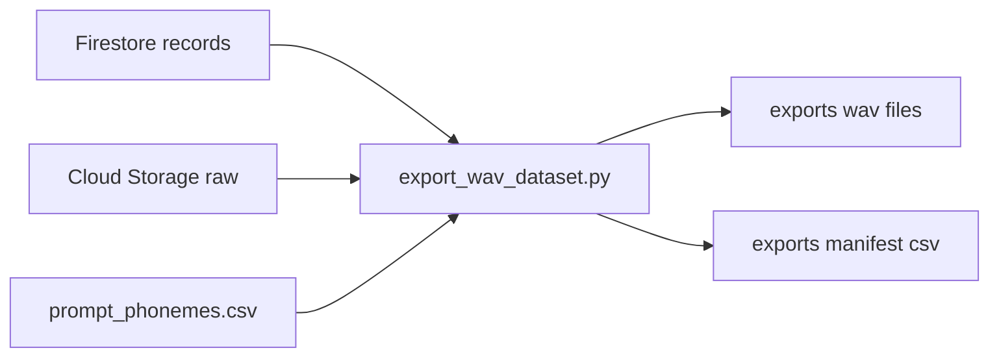

# 10-Tutorial-Step10-Admin-Wav-Export

## Chapter 0: このチュートリアルのゴール

この章のゴールは次の3つです。

1. 管理者が raw 音声を一括取得できる
2. 取得しながら `16kHz mono s16 wav` に変換できる
3. wav ファイル名に音素情報を入れて保存できる

対象は **管理者のローカルPC実行** です。  
Web画面やAPIの仕様は変えません。

---

## Chapter 1: 全体像



ポイント:

- `records` から対象 record を読む
- `raw_path` の実ファイルを Storage から取得する
- `prompt_id` は `prompt_phonemes.csv` で音素列に変換する

---

## Chapter 2: 追加されたファイル

1. `api/scripts/export_wav_dataset.py`
2. `infra/mappings/prompt_phonemes.csv`

`prompt_phonemes.csv` の列:

- 必須: `prompt_id`, `prompt_text`, `phoneme_seq`
- 任意: `phoneme_slug`

ファイル名規則:

- `<phoneme_slug>__<uid>__<record_id>.wav`

保存先:

- `exports/wav/<phoneme_slug>/...`

---

## Chapter 3: 実行前の準備

### 3-1. Python環境

```bash
cd api
source .venv/bin/activate
pip install -r requirements.txt
```

### 3-2. ffmpeg確認

```bash
ffmpeg -version
```

### 3-3. ADC設定

```bash
gcloud auth application-default login
gcloud auth application-default set-quota-project moracollect-watlab
```

---

## Chapter 4: 実行コマンド

### 4-1. dry-run（変換しない）

```bash
cd api
python3 scripts/export_wav_dataset.py \
  --bucket moracollect-watlab.firebasestorage.app \
  --mapping-csv ../infra/mappings/prompt_phonemes.csv \
  --dry-run
```

成功時に見るポイント:

- `total`（対象件数）
- `missing_mapping`（未マップ件数）

### 4-2. 本実行

```bash
cd api
python3 scripts/export_wav_dataset.py \
  --bucket moracollect-watlab.firebasestorage.app \
  --mapping-csv ../infra/mappings/prompt_phonemes.csv \
  --out-dir ../exports
```

---

## Chapter 5: 出力結果の見方

### 5-1. wav出力

- `exports/wav/<phoneme_slug>/<phoneme_slug>__<uid>__<record_id>.wav`

### 5-2. manifest

- `exports/manifests/export_<timestamp>.csv`

主な列:

1. `record_id`
2. `uid`
3. `prompt_id`
4. `prompt_text`
5. `phoneme_seq`
6. `raw_path`
7. `wav_path_local`
8. `status` (`exported|skipped|failed`)
9. `error`

---

## Chapter 6: よくあるエラーと対処

### 6-1. `DefaultCredentialsError`

原因:

- ADC未設定

対処:

```bash
gcloud auth application-default login
```

### 6-2. `ffmpeg is not installed or not in PATH`

原因:

- ffmpeg未インストール

対処:

- ffmpegをインストールして `ffmpeg -version` で確認

### 6-3. `failed` が多い（manifest）

原因候補:

1. `prompt_id` が CSV に未登録
2. `raw_path` のファイルが Storage に存在しない
3. 元音声が壊れていて ffmpeg 変換失敗

対処:

1. `infra/mappings/prompt_phonemes.csv` を補完
2. Storage 上のオブジェクト有無を確認
3. `error` 列の内容で対象を個別再実行

---

## Chapter 7: このStepの制約

このStep10-Aでは次はやりません。

1. Firestore `status` の更新
2. `wav_path` の書き戻し
3. `qc` 保存
4. Cloud Run Jobs 自動化

これらは次段（Step10-B）で対応します。

---

## Chapter 8: 完了チェック

1. dry-runで件数が確認できる
2. 本実行で wav が作成される
3. manifest に `exported/skipped/failed` が記録される
4. Webアプリ既存機能に影響がない
