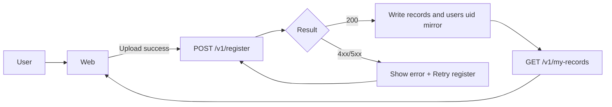

# MoraCollect — DESIGN.md
表示名: **MoraCollect**  
リポジトリ名: **moracollect-corpus**

---

## 0. このドキュメントの目的
このドキュメントは、**音声データ収集だけ**にフォーカスした Web アプリ（MoraCollect）を、はじめて公開する人でも迷わず作れるようにするための **設計指針** と **段階的テスト手順**（スモールステップで公開→検証→次へ）をまとめたものです。

> 強制アライメント（pydomino）や最終的な耳チェックは別工程とし、このWebアプリは「収集・整理・可視化（進捗/ランキング）」に集中します。

### 0.1 現在地（2026-02-25時点）
- Step0〜Step9 は完了
  - Step0: Hosting公開
  - Step1: Firebase Auth（Google）ログイン
  - Step2: 認証付き `/v1/ping`
  - Step3: 表示名プロフィール（`/v1/profile`）
  - Step4: 録音UI（録音/停止/再生 + 波形）
  - Step5: 署名付きURLアップロード（`/v1/upload-url`）
  - Step6: records登録（`/v1/register`, `/v1/my-records`）
  - Step7: 任意prompt選択 + 件数可視化（`/v1/scripts`, `/v1/prompts`）
  - Step8: 自分のrecord削除 + My records再読込 + read最小化（手動Refresh + snapshot）
  - Step9: 累計Top10ランキング（`/v1/leaderboard`）
- 実装済み要素: Auth / Profile / Recording / Waveform / Upload / Register / My records / My records playback load / Script & Prompt selection / Read-minimized stats fetch / Leaderboard
- Step7の標準データ:
  - script: `s-gojuon`（表示名 `50音`）1件
  - prompts: 104件（清音46 + 濁音/半濁音25 + 拗音33）
  - 表示順: `order` による固定50音順
- 次アクション: **Step10-A（管理者ローカル一括 raw→wav 変換）**

---

## 1. スコープ
### 1.1 目的
- コミュニティの協力者が **Web上でログイン**して
- 用意された読み上げプロンプト（スクリプト）に沿って **録音**
- 収録音声を **安全にアップロード**
- 管理者/コミュニティが **進捗とランキング**を見られる
- 後工程（アライメント等）で使いやすいよう、音声を **16kHz WAV** に統一

### 1.2 非目的（このアプリではやらない）
- 音素境界やひらがなラベルの確定（pydomino等の後工程）
- 学習・推論・評価（発話スコアリングなど）
- 高度なモデレーション（必要になったら拡張）

---

## 2. 技術スタック（インフラと言語）
### 2.1 ざっくり結論
- **フロント**: Web（TypeScript/JavaScript）  
  - 理由: ブラウザ録音（MediaRecorder）は Web API のため
- **サーバ側**: できるだけ **Python**  
  - API: FastAPI on **Cloud Run**
  - 非同期ジョブ: Python + ffmpeg on **Cloud Run Jobs**
- **Firebase中心**: Hosting / Auth / Firestore  
  - ストレージは **Google Cloud Storage**（Firebase Storageでも同等）

### 2.2 採用サービス
- Firebase Hosting（フロント配信）
- Firebase Auth（コミュニティ向けログイン）
- Firestore（メタデータ・集計・ランキング）
- Cloud Storage（raw音声、変換後wav）
- Cloud Run（FastAPI APIサーバ）
- Cloud Run Jobs（音声変換/QC/集計更新）

### 2.3 理由（設計指針）
- 初回公開で事故りがちなのは **認証** と **アップロード** と **運用**  
  Firebase + Cloud Run は、この3つを最短で堅く作れる
- 大きい音声を API 経由で受けない（＝コスト/障害/遅延が増える）  
  → **署名付きURL**でブラウザからStorageへ直PUTする

---

## 3. 全体アーキテクチャ
### 3.1 データフロー（推奨）
1. ユーザーが Firebase Auth でログイン
2. フロントが Cloud Run API に **IDトークン付き**でアクセス
3. API が Storage の **署名付きアップロードURL**を発行
4. フロントが署名付きURLへ **直接アップロード**
5. フロントが API に **register**（メタデータ登録）
6. Storageイベント（または定期/手動）で Cloud Run Jobs が起動
7. raw → wav（16kHz mono s16）変換 + QC
8. Firestore の record を processed に更新
9. 集計（進捗/ランキング）を更新
10. 管理画面/ダッシュボードに反映

### 3.2 権限モデル（推奨）
- `collector`（収録者）: 収録・自分の履歴閲覧
- `admin`（管理者）: 全体閲覧、ランキング、フラグ更新、ダウンロード等

---

## 4. リポジトリ構成（ディレクトリ）
モノレポ推奨（1つのリポジトリで web/api/jobs を管理）

```
moracollect-corpus/
├─ web/                         # フロント (Firebase Hosting)
│  ├─ src/
│  ├─ public/
│  ├─ firebase.json             # Hosting設定（ルートにも置く場合あり）
│  └─ package.json
│
├─ api/                         # Python API (FastAPI) -> Cloud Run
│  ├─ app/
│  │  ├─ main.py                # FastAPI entrypoint
│  │  ├─ auth.py                # Firebase ID token verify
│  │  ├─ storage.py             # Signed URL発行など
│  │  ├─ firestore.py           # DBアクセス
│  │  └─ models.py              # Pydantic models
│  ├─ Dockerfile
│  └─ pyproject.toml            # or requirements.txt
│
├─ jobs/                        # 非同期ジョブ (Cloud Run Jobs)
│  ├─ audio_pipeline/
│  │  ├─ main.py                # raw->wav & QC & stats update
│  │  ├─ qc.py                  # クリップ/無音など簡易QC
│  │  ├─ ffmpeg.py              # 変換ラッパ
│  │  └─ constants.py
│  ├─ Dockerfile
│  └─ pyproject.toml
│
├─ infra/
│  ├─ README.md                 # 初期セットアップメモ
│  └─ env.example               # 環境変数の雛形
│
├─ DESIGN.md
└─ README.md
```

> どこに Firebase 設定ファイル（firebase.json 等）を置くかは好みだが、
> 初学者は **web/** の下にまとめるのがおすすめ。

---

## 5. Firestore データ設計（最小＋拡張しやすい）
### 5.1 users
`users/{uid}`
- `display_name`: string（ランキング表示用）
- `role`: `"admin" | "collector"`
- `is_hidden`: bool（ランキングや公開ボードから除外）
- `created_at`

### 5.2 prompts（最小単位）
`prompts/{prompt_id}`
- `text`: "あ" / "か" / "こんにちは" など
- `type`: `"mora" | "word" | "sentence"`
- `script_id`: string（どのスクリプトに属するか）
- `order`: number（並び順）
- `is_active`: bool

### 5.3 scripts（読み上げセット）
`schemas/scripts/{script_id}`（あるいは `scripts/{script_id}`）
- `title`: string（例: "母音セット"）
- `description`: string
- `prompt_ids`: array（小規模なら。大規模なら prompts に script_id を持たせる）
- `is_active`: bool

### 5.4 records（1発話=1レコード）
`records/{record_id}`
- `uid`: string
- `record_id`: string（doc id と同値）
- `prompt_id`: string（Step7でユーザー選択値を保存）
- `script_id`: string（Step7でユーザー選択値を保存）
- `raw_path`: string（`raw/{uid}/{record_id}.{ext}`）
- `wav_path`: string（Step6では空文字）
- `created_at`: timestamp
- `updated_at`: timestamp
- `status`: `"uploaded" | "processing" | "processed" | "failed"`
- `client`: object（ua/os/browser/device_hint など最小メタ）
- `recording`: object（mime_type/size_bytes/duration_ms）
- `qc`: object
  - `duration_sec`
  - `rms_db`（簡易）
  - `clipped`: bool
  - `silence_ratio`: float
  - `ok`: bool
  - `notes`: string（任意）

> `qc` は主に Step10 で更新。Step6時点では未設定でもよい。

### 5.5 users配下の履歴ミラー（Step6）
`users/{uid}/records/{record_id}`
- `record_id`: string
- `status`: `"uploaded" | "processing" | "processed" | "failed"`
- `raw_path`: string
- `script_id`: string
- `prompt_id`: string
- `prompt_text`: string（Step8で追加。`GET /v1/my-records` の軽量表示用）
- `mime_type`: string
- `size_bytes`: number
- `duration_ms`: number
- `created_at`: timestamp

> 役割: `GET /v1/my-records` を軽く実装するための表示用ミラー。  
> 正本は `records/{record_id}`。

### 5.6 集計（進捗）
`stats_prompts/{prompt_id}`
- `script_id`: string
- `total_records`: number
- `unique_speakers`: number
- `updated_at`: timestamp
- `last_record_at`: timestamp

`stats_prompts/{prompt_id}/speakers/{uid}`
- `uid`: string
- `created_at`: timestamp

`stats_scripts/{script_id}`
- `total_records`: number
- `unique_speakers`: number
- `updated_at`: timestamp
- `last_record_at`: timestamp

`stats_scripts/{script_id}/speakers/{uid}`
- `uid`: string
- `created_at`: timestamp

### 5.7 ランキング表示用（スナップショット）
`leaderboards/{period}/ranks/{uid}`
- `display_name`
- `count`
- `rank`
- `updated_at`

> period例: `all`, `weekly-2026-W07`, `monthly-2026-02`

### 5.8 scripts/prompts の read最適化スナップショット（Step8.2）
`snapshots/scripts_overview/docs/current`
- `scripts_map`: map
  - key: `script_id`
  - value: `script_id/title/description/order/is_active/prompt_count/total_records/unique_speakers`
- `updated_at`

`snapshots/prompts_by_script/docs/{script_id}`
- `script_id`
- `prompts_map`: map
  - key: `prompt_id`
  - value: `prompt_id/text/order/is_active/total_records/unique_speakers`
- `updated_at`

> 役割: `GET /v1/scripts` と `GET /v1/prompts` を「1doc読み中心」にするためのキャッシュ。  
> 正本は `scripts/prompts/stats_*`。  
> seed更新後は `api/scripts/build_stats_snapshots.py` で再構築する。

---

## 6. Cloud Storage パス設計（推奨）
- raw: `raw/{uid}/{record_id}.webm`（端末により m4a 等も）
- wav: `wav/{uid}/{record_id}.wav`
- qc（任意）: `qc/{uid}/{record_id}.json`

> uid をパスに含めると、削除依頼対応やアクセス制御で助かる。

---

## 7. API 設計（Python / FastAPI）
### 7.1 認証
- フロントで Firebase Auth ログイン
- リクエストに `Authorization: Bearer <ID_TOKEN>`
- API側で Firebase Admin SDK 等で検証して `uid` を得る
- `users/{uid}.role` を参照し、admin エンドポイントを保護

### 7.2 エンドポイント（最小セット）
#### Collector
- `GET /v1/ping`  
  - 認証確認、uid返却
- `GET /v1/scripts`
  - 収録用 script 一覧（`prompt_count/total_records/unique_speakers` を含む）
- `GET /v1/prompts?script_id=...`  
  - 選択script内の prompt 一覧（`total_records/unique_speakers` を含む）
- `POST /v1/upload-url`  
  - body: `{ext, content_type}`  
  - return: `{record_id, upload_url, raw_path, required_headers}`
- `POST /v1/register`  
  - body: `{record_id, raw_path, script_id, prompt_id, client_meta, recording_meta}`
- `GET /v1/my-records?limit=...`  
  - 自分の収録履歴
- `GET /v1/my-records/{record_id}/playback-url`
  - 自分の raw 音声を再生するための署名付きGET URLを返す
- `DELETE /v1/my-records/{record_id}`
  - 自分の record を Firestore + Storage から完全削除

#### Profile
- `GET /v1/profile`
- `POST /v1/profile`  
  - body: `{display_name}`

#### Dashboard (Public/Community)
- `GET /v1/dashboard/scripts`  
  - scriptごとの総数/人数/達成率
- `GET /v1/leaderboard?period=all|weekly|monthly`  
  - 上位N

#### Admin
- `GET /v1/admin/records?...`
- `POST /v1/admin/records/{record_id}/flag`（不採用、メモ等）
- `POST /v1/admin/download-url`（wavの署名付きDL URL）

### 7.3 署名付きURLの方針
- アップロード: Signed URL（PUT）
- ダウンロード: Signed URL（GET）※管理者だけ or 収録者本人だけ

### 7.4 Step7で固定するインターフェース（決定版）
#### `POST /v1/register`（auth required）
- Request
  - `record_id`: UUID文字列（必須）
  - `raw_path`: `raw/{uid}/{record_id}.{ext}`（必須）
  - `script_id`: string（必須）
  - `prompt_id`: string（必須）
  - `client_meta`: object（任意）
  - `recording_meta`: object（任意）
    - `mime_type`, `size_bytes`, `duration_ms`
- Response（成功）
  - `ok: true`
  - `record_id`
  - `status: "uploaded"`
  - `already_registered: boolean`
- Error
  - `401`: auth invalid
  - `400`: invalid record_id / invalid raw_path / uid mismatch
  - `400`: invalid script_id / invalid prompt_id
  - `400`: prompt does not belong to script
  - `404`: raw object not found
  - `409`: record_id already owned by different uid

#### `GET /v1/scripts`（auth required）
- Response
  - `ok: true`
  - `scripts: []`
  - 各要素: `script_id/title/description/order/is_active/prompt_count/total_records/unique_speakers`
- 実装方針（Step8.2）
  - まず `snapshots/scripts_overview/docs/current` を読む
  - snapshot未存在時のみ従来集計読み（fallback）へ退避

#### `GET /v1/prompts?script_id=...`（auth required）
- Response
  - `ok: true`
  - `script_id`
  - `prompts: []`
  - 各要素: `prompt_id/text/order/is_active/total_records/unique_speakers`
- 実装方針（Step8.2）
  - まず `snapshots/prompts_by_script/docs/{script_id}` を読む
  - snapshot未存在時のみ従来読取（fallback）へ退避

#### `GET /v1/my-records?limit=...`（auth required）
- Response
  - `ok: true`
  - `records: []`（自分の履歴のみ）
  - 各要素: `record_id/status/script_id/prompt_id/prompt_text/raw_path/mime_type/size_bytes/duration_ms/created_at`
- limit
  - 既定: `20`
  - 上限: `50`

#### `GET /v1/my-records/{record_id}/playback-url`（auth required）
- Response
  - `ok: true`
  - `record_id`
  - `raw_path`
  - `mime_type`
  - `playback_url`（署名付きGET URL）
  - `expires_in_sec`（既定: 600）
- 備考
  - URL期限切れ時はフロントで1回だけ自動再取得して再試行する（Step8.1）

#### `DELETE /v1/my-records/{record_id}`（auth required）
- 成功
  - `ok: true`
  - `record_id`
  - `deleted: true`
- エラー
  - `401`: 未認証
  - `403`: 他人record
  - `404`: record not found
  - `500`: delete failed

---

## 8. 非同期ジョブ（Cloud Run Jobs）
### 8.1 役割
- raw 音声を受け取り、wavへ統一
- QC を計算し Firestore に書き戻す
- 進捗/ランキングの集計を更新

### 8.2 起動方法（段階的）
初心者向けに、最初は **手動実行**で良い  
- recordをいくつか貯める
- ジョブを手動で走らせて変換を確認

安定したらイベント駆動へ
- Storage通知 → Pub/Sub → Job 起動（設計は後追いでOK）

### 8.3 変換仕様（推奨）
- 出力: WAV, 16kHz, mono, 16-bit PCM
- ffmpeg 例（概念）:
  - `-ac 1 -ar 16000 -sample_fmt s16`

### 8.4 QC（最小）
- duration（短すぎ/長すぎ）
- クリッピング検出（波形の飽和）
- 無音率（しきい値以下の割合）
- RMS目安（極端に小さい/大きい）

---

## 9. 管理画面（コミュニティ全体の進捗＋ランキング）
### 9.1 最低限の見せ方（推奨）
- スクリプト一覧カード
  - `title`
  - `unique_speakers`
  - `total_records`
  - 目標値があるなら `progress = total / target`
- ランキング（上位20）
  - `display_name`
  - `count`（期間別）

### 9.2 プライバシー配慮（推奨）
- コミュニティ画面は「個別音声のURL」を出さない  
  （出す場合は本人のみ or 管理者のみ）
- `users.is_hidden` でランキング非表示にできる
- 収録者の uid はUIに表示しない（内部ID）

---

## 10. 開発環境とデプロイ（方針）
### 10.1 ローカル開発
- web:
  - `npm i`
  - `npm run dev`
- api:
  - `python -m venv .venv && source .venv/bin/activate`
  - `pip install -r requirements.txt`（or `uv sync`）
  - `uvicorn app.main:app --reload`

### 10.2 本番デプロイ
- web → Firebase Hosting
- api → Cloud Run（Dockerビルド）
- jobs → Cloud Run Jobs（Dockerビルド）

> 最初は手動デプロイでOK。慣れたら GitHub Actions で自動化する。

---

## 11. 段階的に完成させるテスト手順（スモールステップ）
> 重要: 各ステップは「本番URLで動く状態」にしてから次へ進む  
> （ローカルで完璧にしてから公開、は初回はハマりやすい）

### Step 0: 公開の最小体験（Hostingだけ）
**実装**
- Firebaseプロジェクト作成
- Hosting に “Hello MoraCollect” をデプロイ

**テスト**
- PC/スマホでURLを開ける
- HTTPS になっている

**合格条件**
- 公開URLが存在し、誰でもアクセスできる

---

### Step 1: ログイン機能だけ（Auth）
**実装**
- Firebase Auth を有効化（推奨: Googleログイン）
- ログイン/ログアウトUI

**テスト**
- 新規ユーザーがログインできる
- リロードしてもログイン状態が保たれる
- ログアウトで状態が消える

**合格条件**
- 認証が安定して動く

---

### Step 2: Python API を認証付きで叩く（Cloud Run + FastAPI）
**実装**
- Cloud Run に `/v1/ping` をデプロイ
- フロントから IDトークンを付けてアクセス
- API側でトークン検証して uid を返す

**テスト**
- 未ログイン: 401
- ログイン: 200 + uid
- CORS エラーが出ない

**合格条件**
- 認証付きのフロント↔Python疎通が完成

---

### Step 3: 表示名（ユーザー名）登録（Firestore）
**実装**
- `users/{uid}` を作成・更新する `/v1/profile`
- フロントに表示名入力フォーム

**テスト**
- 表示名が保存される
- 再ログイン後も残る
- 文字数制限が効く（例: 2〜20文字）

**合格条件**
- ランキングに必要な “名前” が持てる

---

### Step 4: 録音UI（保存しない）
**実装**
- MediaRecorder で録音→停止→再生

**テスト**
- iPhone/Android/PC で録音できる
- 2回以上連続で録音できる
- 長さ（例: 1〜5秒）で安定

**合格条件**
- 録音の基本が端末差を越えて動く

---

### Step 5: 署名付きURLで raw 音声を Storage にアップロード
**実装**
- `/v1/upload-url` を作成（record_id発行含む）
- フロントは署名付きURLにPUT

**テスト**
- アップロード成功
- Storageに `raw/{uid}/{record_id}.*` が存在
- 他人のuidパスを使えない設計になっている

**合格条件**
- “録音→保存” が成立

---

### Step 6: register（メタデータ登録）で records を増やす
**実装**
- Upload成功直後に Web から `POST /v1/register` を**自動実行**
- `records/{record_id}` を作成（status=`uploaded`）
- `users/{uid}/records/{record_id}` の表示用ミラーを作成
- `GET /v1/my-records` で自分の履歴を返す
- register失敗時は Web 側で `Retry register` を出す

**Step6の境界（In/Out）**
- In
  - register
  - my-records
  - Web自動register
  - retry
- Out
  - prompts/scripts UI（Step7）
  - raw→wav/QC（Step10）
  - 既存rawのbackfillツール

**データフロー（Step6）**


**Step6で固定するAPI仕様**
- `POST /v1/register`（auth required）
  - Request: `record_id`(UUID), `raw_path`, `client_meta`, `recording_meta`
  - `raw_path` は `raw/{uid}/{record_id}.{ext}` 形式を強制
  - Storageに対象オブジェクトが存在することを確認
  - 成功: `ok=true`, `status="uploaded"`, `already_registered`
  - エラー:
    - `401` auth invalid
    - `400` invalid record_id/raw_path/uid mismatch
    - `404` raw object not found
    - `409` record_id already owned by different uid
- `GET /v1/my-records?limit=...`（auth required）
  - 自分の履歴のみ返却
  - デフォルト20件、上限50件
  - 新しい順で返す

**テスト**
- Firestoreに records が増える
- status が uploaded
- 自分の履歴 `GET /v1/my-records` が見れる
- Upload後に自動registerが走る
- register失敗時にRetryで復旧できる

**合格条件**
- 音声が「管理可能な形」で貯まる
- 他人UIDのパスではregisterできない
- エラー規約（401/400/404/409）が守られる

---

### Step 7: prompts / scripts を表示して、収録を回せるUIへ
**実装**
- Firestoreに `scripts` / `prompts` を投入（seedで再現可能にする）
  - `infra/seeds/scripts.json`
  - `infra/seeds/prompts.json`
  - `api/scripts/seed_step7_data.py`
- `GET /v1/scripts` と `GET /v1/prompts` を追加
- フロントに `script select + prompt button grid` を追加
- promptは任意選択で録音し、Upload/Registerへ接続する
- Register時に `script_id/prompt_id` を保存し、固定値を廃止する
- Register成功時に `stats_prompts` / `stats_scripts` を同期更新する
  - `total_records` は毎回 +1
  - `unique_speakers` は `speakers/{uid}` が初回のときのみ +1

**テスト**
- script切替でprompt一覧が切り替わる
- promptボタンは `total_records / unique_speakers` を表示する
- promptを任意選択して録音→upload→registerが成功する
- promptごとに複数takeが取れる
- register直後は表示を維持し、`Refresh counts` 実行時に件数が更新される（Step8.2）
- 同一話者の再録音で `unique_speakers` は増えない

**合格条件**
- 順番固定でなく任意prompt選択で収録を回せる
- 全ユーザーが prompt 単位の偏り（件数/人数）を把握できる

---

### Step 8: 自分のrecord削除（Firestore + Storage）
**実装**
- `DELETE /v1/my-records/{record_id}` を追加
- records / users配下mirror / Storage(raw,wav) を削除
- `stats_prompts` / `stats_scripts` を減算更新
- `GET /v1/my-records/{record_id}/playback-url` を追加（自分の音声再確認）
- URL期限切れ時の自動再取得リトライ（1回）を追加
- **Step8.2 read最小化**
  - register/delete 後の scripts/prompts 自動再取得を停止
  - scripts/prompts は手動 `Refresh counts` で更新
  - `GET /v1/scripts` と `GET /v1/prompts` を snapshot-first 読みへ変更
  - register/delete transaction で snapshot も同期更新
  - snapshot再構築スクリプト `api/scripts/build_stats_snapshots.py` を追加

**テスト**
- 自分のrecord削除で `200`
- 他人recordは `403`
- 削除後に `My records` から消える
- prompt/script 件数が必要に応じて減る（手動 `Refresh counts` で確認）
- `Load` で自分の音声再生と波形再表示ができる
- 署名付きURL期限切れ時に1回自動再取得して復旧する
- ログイン直後の scripts/prompts 読みが snapshot 1docずつ中心で動く

**合格条件**
- ユーザーが自分の誤登録データを安全に削除できる
- 高頻度操作でも Firestore read を抑えながら運用できる

---

### Step 9: コントリビュートランキング
**実装**
- `GET /v1/leaderboard` を実装
- `users/{uid}.contribution_count` を register/delete 成功時に更新
- メニューの「管理」枠からランキング画面へ遷移
- Top contributors を **Top 10（累計のみ）** 表示
- `users.is_hidden=true` のユーザーは除外
- `avatar_path` がある場合のみ署名URLを発行して表示（失敗時はfallback表示）

**テスト**
- register成功で件数が増える
- delete成功で件数が減る
- 同点時の並びが安定する
- Top 10 のみ表示される
- 画像なしユーザーは紫背景+先頭文字fallbackで表示される

**合格条件**
- 最貢献ユーザー（Top 10）を全員が確認できる

---

### Step 10: 管理者向け raw → wav(16kHz) 一括エクスポート（ローカルバッチ）
**実装**
- 管理者PCで実行する `api/scripts/export_wav_dataset.py` を追加
- `infra/mappings/prompt_phonemes.csv` を正本として `prompt_id -> pydomino音素列` を解決
- Storage `raw_path` を一括ダウンロードし、`ffmpeg` で `16kHz mono s16 wav` へ変換
- 出力先: `exports/wav/{phoneme_slug}/{phoneme_slug}__{uid}__{record_id}.wav`
- 結果を `exports/manifests/export_<timestamp>.csv` に記録
- この段階では Firestore の `status/wav_path/qc` は更新しない

**テスト**
- dry-runで対象件数を確認できる
- 本実行でwavが生成される（16kHz/mono）
- `prompt_id` 未マップ・raw欠損・ffmpeg失敗が `failed` としてmanifestに残る
- 例外が1件あっても全体処理は継続する

**合格条件**
- 学習開発者が管理者権限で raw を一括収集し、音素列付きファイル名で wav を得られる
- 既存Web/API機能へ回帰を出さない

**次段（Step10-B）**
- Cloud Run Jobs 化
- `wav_path` と `qc` を Firestore `records` へ反映
- `status=processed/failed` 遷移を自動化

---

## 12. 受け入れ基準（Definition of Done）
- ログインして録音し、アップロードできる
- recordsがFirestoreに溜まり、statusが追跡できる
- 管理者が raw を wav(16kHz) に一括変換して取得できる
- script別の「話者数」「データ数」が見える
- ランキングが表示できる（累計、必要なら週/月も）

### 12.1 Step6 詳細DoD（先行確定）
- Upload後に `POST /v1/register` で records が作成される
- `GET /v1/my-records` で自分の履歴のみ表示される
- `status="uploaded"` で保存される
- 未認証は `401`
- 不正 `record_id/raw_path/uid mismatch` は `400`
- raw未存在は `404`
- 他人UIDで同一 `record_id` 競合は `409`

### 12.2 Step7 詳細DoD（任意prompt収録）
- `GET /v1/scripts` が `prompt_count/total_records/unique_speakers` を返す
- `GET /v1/prompts?script_id=...` が prompt一覧と件数を返す
- `POST /v1/register` は `script_id/prompt_id` を必須として保存する
- `script_id` 不正は `400`、`prompt_id` 不正は `400`
- `prompt` が `script` に属さない場合は `400`
- register成功時に `stats_prompts` / `stats_scripts` が更新される
- 同一話者の同一prompt再登録で `unique_speakers` は増えない

### 12.3 Step8 詳細DoD（自分のrecord削除）
- `DELETE /v1/my-records/{record_id}` で自分のrecordのみ削除できる
- records / users配下mirror / Storage(raw,wav) が削除される
- 削除後に `stats_prompts` / `stats_scripts` が整合した値に更新される
- 未認証は `401`
- 他人recordは `403`
- 不存在recordは `404`

### 12.4 Step8.2 詳細DoD（read最小化）
- register/delete 後に scripts/prompts の自動再取得が走らない
- `Refresh counts` 実行時のみ scripts/prompts が再取得される
- `GET /v1/scripts` が snapshot doc（`snapshots/scripts_overview/docs/current`）を優先利用する
- `GET /v1/prompts` が snapshot doc（`snapshots/prompts_by_script/docs/{script_id}`）を優先利用する
- snapshot欠損時に fallback経路でAPIは継続動作する
- `GET /v1/my-records` は `prompt_text` を返し、prompt docの追加読取を不要化する

### 12.5 Step9 詳細DoD（Top10ランキング）
- `GET /v1/leaderboard?limit=10` が `200` と `period="all"` を返す
- 返却順は `contribution_count desc` -> `display_name asc` -> `uid asc`
- `users.is_hidden=true` はランキングに含まれない
- `contribution_count<=0` はランキングに含まれない
- メニューの「ランキング」ボタンからランキング画面に遷移できる
- 画面はTop10のみ表示し、`更新` ボタンで手動再取得できる
- ランキング画面表示中に register/delete すると件数が再反映される

### 12.6 Step10-A 詳細DoD（管理者ローカル一括wavエクスポート）
- `api/scripts/export_wav_dataset.py` が `--bucket` と `--mapping-csv` で実行できる
- `--dry-run` でダウンロード/変換なしの対象件数確認ができる
- 変換成功時に `exports/wav/<phoneme_slug>/<phoneme_slug>__<uid>__<record_id>.wav` が生成される
- 実行結果が `exports/manifests/export_<timestamp>.csv` に `exported/skipped/failed` で記録される
- `prompt_id` 未マップ・raw欠損・ffmpeg失敗が `failed` で継続処理される
- Firestoreデータは読み取りのみで更新しない

---

## 13. 初回公開での安全対策（必須）
- Auth必須（未ログインは録音/アップロード不可）
- 管理者APIは role=admin のみ
- アップロードは署名付きURLのみ（APIに音声を通さない）
- ダウンロードURLは原則、管理者のみ（または本人のみ）
- 表示名は不適切語対策（最低限: 長さ/禁止文字、後で拡張）

---

## 14. 次に書くべき README.md の最小構成（メモ）
- MoraCollect とは何か（収集コーパス用）
- できること（録音収集、進捗、ランキング）
- 構成（Firebase + Cloud Run + Firestore + GCS）
- 開発方法（web/api/jobs の起動）
- デプロイ手順（Hosting, Run, Jobs）

---

## 15. 用語
- **mora**: 日本語のモーラ（ひらがな単音に近い単位）
- **corpus**: コーパス（収集データ集合）
- **record**: 1発話=1ファイルの単位
- **script**: 読み上げスクリプト（複数promptの集合）
- **prompt**: 読み上げるテキスト（最小単位）

---

## 16. Step7での前提（Assumptions / Defaults）
- 対象プロジェクト: `moracollect-watlab`
- Step7では既存rawのbackfillは実施しない
- Upload成功後のregisterはWeb側で自動実行
- Storage実在チェックはregister時に実施
- recordsの正本は `records/{record_id}`
- 収録順は固定しない（ボタンから任意選択）
- 画面表示順は `order` 固定（50音順）
- prompt件数は `total_records + unique_speakers` を表示する

---

## 17. 実装時につまずきやすい点（Step0〜Step8）
### 17.1 セットアップ系
- `Failed to get Firebase project your-firebase-project-id`
  - 原因: `.firebaserc` がプレースホルダのまま
  - 対処: 実プロジェクトIDへ置換
- `Firebase is not configured. Missing required environment variable ...`
  - 原因: `web/.env.local` 未作成/未設定
  - 対処: `web/.env.example` から作成して実値を設定

### 17.2 認証系（モバイル含む）
- `auth/configuration-not-found`
  - 原因: Firebase Auth の Google provider 未有効化
  - 対処: Firebase Console > Authentication > Sign-in method で Google 有効化
- `redirect_uri_mismatch` / 「アクセスをブロック: このアプリのリクエストは無効です」
  - 原因候補: 認証ドメイン不整合、古いビルド、認可ドメイン設定不足
  - 対処: `VITE_FIREBASE_AUTH_DOMAIN` と authorized domains を整合させ、再ビルド/再デプロイ

### 17.3 Cloud Run / Storage系
- Cloud Run deploy時の billing エラー（`Billing account ... not found`）
  - 原因: プロジェクトで請求未設定
  - 対処: Billing を有効化して再デプロイ
- `Failed to generate upload URL`（`/v1/upload-url` が500）
  - 原因候補: 署名権限不足（`iam.serviceAccounts.signBlob` 系）、bucket/env設定不一致
  - 対処: 実行SA権限と `STORAGE_BUCKET` を確認、Cloud Run再デプロイ
- `Upload status: failed (Failed to fetch)`（ブラウザ）
  - 原因候補: Storage CORS 未設定
  - 対処: bucket CORS に Hosting/localhost origin と `PUT, OPTIONS` を追加

### 17.4 Step7 seed/データ整合系
- `Scripts: failed (Not Found)`
  - 原因候補: Step7未反映APIを参照、`VITE_API_BASE_URL` の向き先違い
  - 対処: `/openapi.json` で `/v1/scripts` の有無確認、API/Hosting再デプロイ
- `ModuleNotFoundError: No module named 'firebase_admin'`（seed実行時）
  - 原因: `.venv` 未有効化または依存不足
  - 対処: `source .venv/bin/activate` + `pip install -r requirements.txt`
- `DefaultCredentialsError`（seed実行時）
  - 原因: ADC未設定
  - 対処: `gcloud auth application-default login`
- `UserWarning: ... without a quota project`（seed実行時）
  - 意味: 警告（失敗とは限らない）
  - 対処: `gcloud auth application-default set-quota-project moracollect-watlab`
- `prompt ... references unknown script_id ...`
  - 原因: `scripts.json` と `prompts.json` の `script_id` 不一致
  - 対処: 参照先IDを統一して seed 再実行
- 旧script/promptがUIに残る
  - 原因: Firestoreに旧seedデータが残存
  - 対処: `seed_step7_data.py` を再実行（seed未定義の `scripts/prompts` を prune）

### 17.5 Step8 削除系
- `delete failed (record not found)`
  - 原因: 既に削除済み、または古い画面状態
  - 対処: `My records` を再取得してから再確認
- `delete failed (record does not belong to authenticated user)`
  - 原因: 他人recordの削除要求
  - 対処: 自分の `My records` からのみ削除操作する
- `My records: load failed (Not Found)`
  - 原因候補: Storage側rawオブジェクトが既に無い、または `raw_path` 不整合
  - 対処: 対象recordを削除するか、再録音して新規登録する
- Firestore read が想定より早く消費される
  - 原因候補: scripts/prompts を頻繁に自動再取得している、snapshot未構築でfallbackを踏んでいる
  - 対処:
    - UIは `Refresh counts` のみで更新する運用にする
    - `python3 api/scripts/build_stats_snapshots.py` を実行し snapshot を再生成する
