# MoraCollect User Guide

このページは、MoraCollect を初めて使う方向けの利用ガイドです。  
README とは分けて、実際の使い方を中心に説明します。

## 1. ご利用前の同意事項

MoraCollect は、機械学習モデルのトレーニングに使う音声データを収集するサービスです。  
本サービスを利用した時点で、以下に同意したものとみなします。

1. 収録した音声は AI 学習用途で使用されます。
2. 収録した音声は、開発者がダウンロードして利用する場合があります。
3. 個人情報を学習用途として利用しません。
4. 登録した音声は、ユーザー自身が `My Record` から削除できます。
5. 他ユーザーの音声を閲覧・再生することはできません。

同意を取り消したい場合は、以後の利用を停止し、必要な音声を `My Record` から削除してください。

## 2. ログイン方法（Google / メールアドレス）

### 目的

アプリ機能（収録・アップロード・管理）を使うためにログインします。

### 手順

1. ログイン画面で次のどちらかを選びます。
2. `Sign in with Google` を押して Google でログインする。
3. または、メールアドレスとパスワードを入力して `新規登録` する。
4. メール登録の場合は、届いた確認メールのリンクを開く。
5. その後 `メールでログイン` する。
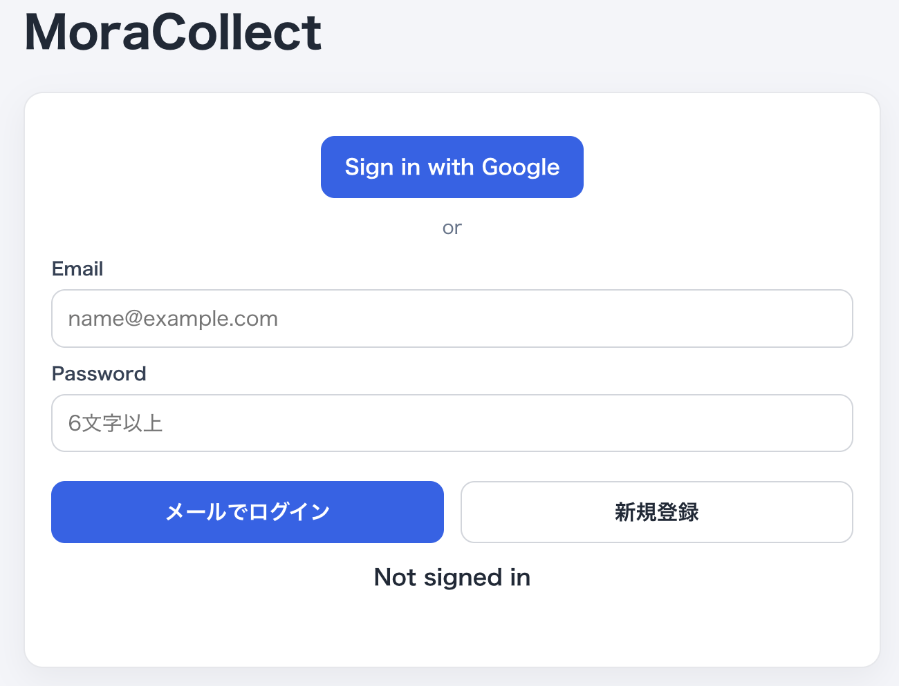

### 注意点

1. メール登録ユーザーは、メール確認が完了するまで機能がロックされます。
2. ロック画面では `確認メール再送` と `確認したので再読み込み` を使えます。

## 3. 最初にやること（アカウント設定）

### 目的

表示名とアイコンを設定して、ランキング表示時にわかりやすくします。

### 手順

1. メニュー画面で `アカウント` を開きます。
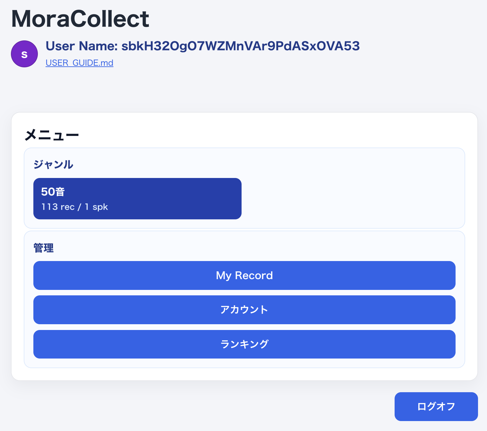
2. 表示名を入力して保存します。
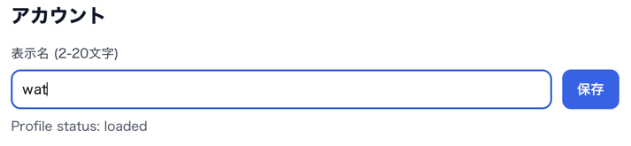
3. 必要ならアイコン画像を登録します。
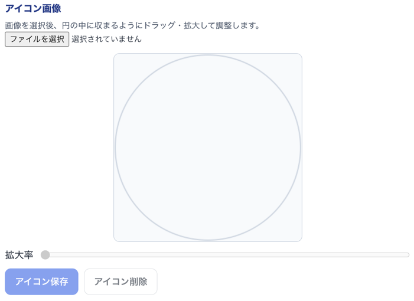

アイコンを保存ボタンをクリックすると、User Nameに反映されます。

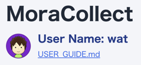

### 注意点

1. 表示名とアイコンはランキング表示にも使われます。
2. アイコン未設定の場合は、ユーザー名の先頭文字が丸いアイコンとして表示されます。

## 4. 音声収録の流れ（ジャンル → プロンプト → 録音）

### 目的

対象の音声を選んで、ブラウザから収録します。

### 手順

1. メニュー画面で `ジャンル` を選びます。
現在は「50音」のジャンルのみ準備されています。

2. `収録する音声` 画面でプロンプトを選びます。
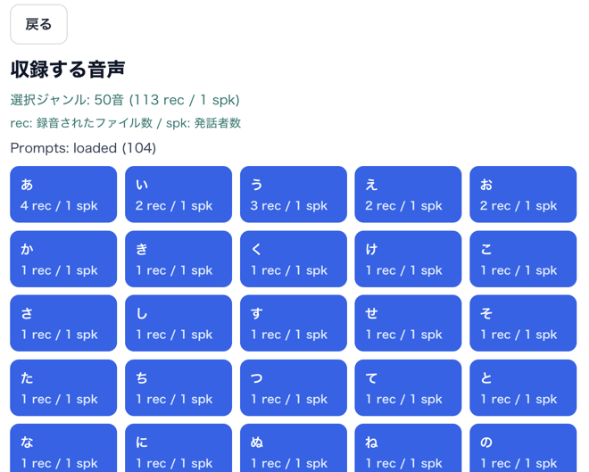
3. `録音開始` を押します。
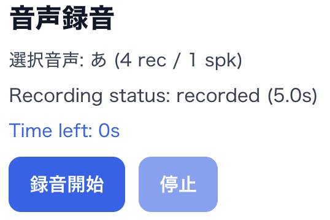
4. 5秒以内に発話します。
5. 必要なら `停止` を押して録音を終了します。
6. 録音後に再生プレイヤーで音声を確認します。
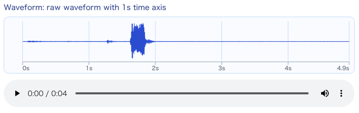

### 再録音する方法

1. 同じ画面で再度 `録音開始` を押します。
2. 前回の録音結果はクリアされ、新しい録音に置き換わります。

### 注意点

1. マイク権限がないと録音できません。
2. スマホではブラウザや OS のマイク許可設定が必要です。
例えばiPhoneでChromeを使っている場合は、アプリの設定でマイク許可設定が必要です。
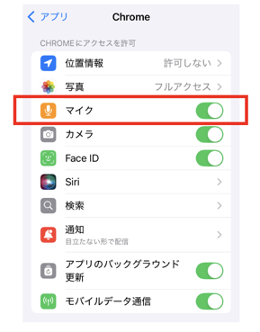

## 5. アップロードと反映

### 目的

収録した音声をサーバーへ登録します。

### 手順

1. 録音確認後に `アップロード` を押します。
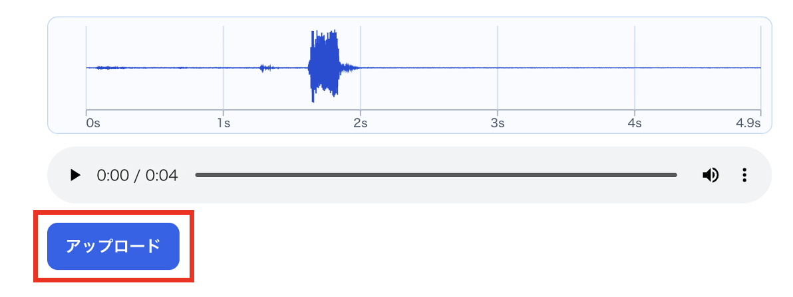
2. 正常終了すると音声データが登録されます。
「いいね」エフェクトが表示されたらアップロード完了です。
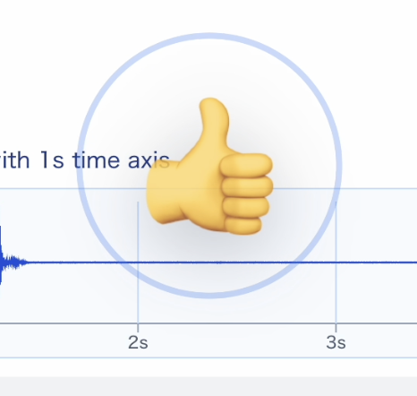
3. プロンプト件数に反映されます。
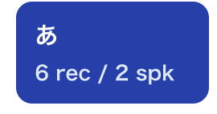
### `rec` / `spk` の意味

1. `rec`: 録音されたファイル数
2. `spk`: 発話者数

### 協力のお願い

できるだけ `rec` や `spk` が少ない項目から登録してもらえると、データの偏りを減らしやすくなります。

## 6. My Record の使い方（確認と削除）

### 目的

自分がアップロードした音声を確認し、必要なら削除します。

### 手順

1. メニュー画面で `My Record` を開きます。

2. 一覧から `読み込む` を押して音声を確認します。
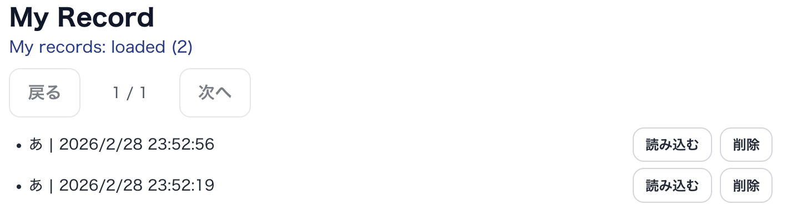
3. 波形と再生プレイヤーで内容を確認します。
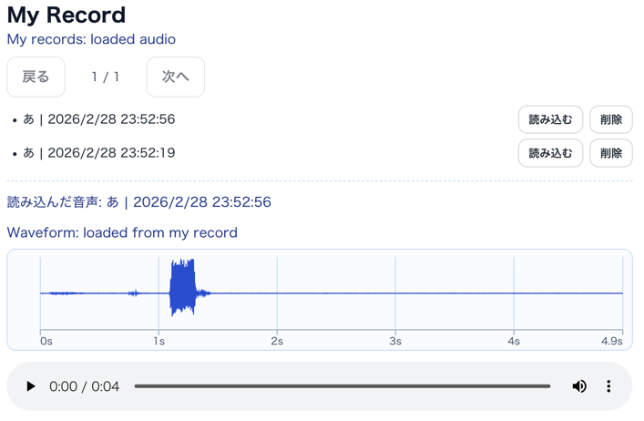
4. 不要な音声は `削除` を押します。

### 注意点

1. 確認・削除できるのは自分の音声だけです。
2. 他ユーザーの音声は閲覧・再生できません。

## 7. ランキング

### 目的

どのユーザーが多く収録に貢献しているかを確認します。

### 内容

1. ランキングでは、`rec` の累計が多いユーザーが上位に表示されます。
2. 表示名とアイコンが表示されます。
3. 競争を目的にするより、収録進捗の共有として活用してください。

## 8. よくある質問

### Q1. メール確認画面から進めません

1. 受信メール内の確認リンクを開いてください。
2. アプリに戻って `確認したので再読み込み` を押してください。
3. メールが届かない場合は `確認メール再送` を使ってください。

### Q2. 録音できません

1. ブラウザのマイク権限を許可してください。
2. スマホの場合は OS 設定でブラウザのマイク許可も確認してください。

### Q3. 間違ってアップロードした音声を消したいです

1. `My Record` で対象音声を確認します。
2. `削除` を押すと自分の登録データを削除できます。
